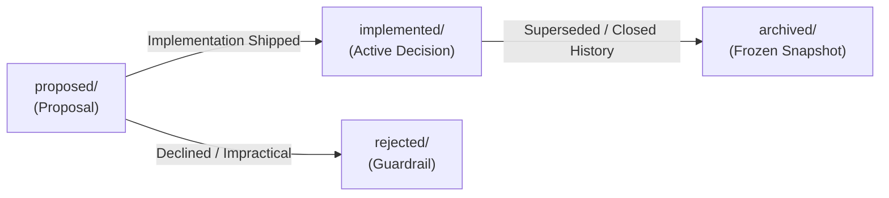

# Pi-Cordis Architecture and Design Decisions (Agent Notes)

English | [中文](README.zh.md)

This directory records architectural decision records (ADRs), technology selections, and trade-off analyses for the **Pi-Cordis** project.

---

## 1. Multi-Level Directory Semantics & Layout

Every Agent Note has two orthogonal axes encoded directly in its file path: `{lifecycle}/{class}/yyyy-mm-dd-topic-title.md`.

```text
.agents/notes/
├── proposed/                  # Proposals under review; not yet built (or partially built)
├── implemented/               # Decisions implemented and shipped in production
│   ├── architecture/          # Structural design, microkernel, capability seams, services
│   ├── feature/               # User- or model-facing agent capabilities
│   ├── simplification/        # Removing dead code/complexity without losing capabilities
│   ├── process/               # Development workflows, gates, tooling
│   ├── testing/               # Testing strategies and infrastructure
│   └── bug-fix/               # Postmortem fixes and architectural defect closure
├── rejected/                  # Proposals considered and declined (retained only if guardrail)
└── archived/                  # Completed historical snapshots that no longer guide future work
    ├── architecture/
    └── simplification/
```

### Primary Axis: Lifecycle (`{lifecycle}/`)
- **`proposed/`**: Proposals under review prior to implementation. Free-form future tense (`## Proposal`, `## Acceptance criteria`, `## Risks`).
- **`implemented/`**: Shipped reality. Kept current with actual code (facts, paths, names). Uses present tense (`## Decision`, `## Consequences`).
- **`rejected/`**: Proposals declined during review. Carries `Status: rejected — <why, in one line>`. Kept only when its rationale prevents a tempting mistake.
- **`archived/`**: Shipped decisions that are 100% complete and whose rationale is superseded or unlikely to guide future changes. Permanently frozen.

### Secondary Axis: Class (`{class}/`)
| Class | Scope & Coverage |
| :--- | :--- |
| `architecture` | Structural decisions about shipped source code: microkernel, service matrices, capability seams, protocols. |
| `feature` | New user-facing or model-facing capabilities (e.g. new plugin, TUI component). |
| `simplification` | Removing code, behavior, or cognitive overhead without sacrificing capability. |
| `process` | Tooling, workflow, package management, and linting around the codebase. |
| `testing` | Test frameworks, mocking strategies, and regression gates. |
| `bug-fix` | Postmortem fixes for subtle architectural defects. |

---

## 2. Lifecycle Progression & Evolution Methodology



### 1. Advancing from `proposed/` to `implemented/`
When code for a proposal is built, verified, and merged:
1. **Move File**: Move from `proposed/{topic}.md` to `implemented/{class}/{topic}.md`.
2. **Update Status**: Change `Status: proposed` to `Status: implemented`.
3. **Rewrite Body**:
   - Replace `## Proposal` with `## Decision` (written in present-tense fact).
   - Fold `## Acceptance criteria` and `## Risks` into `## Consequences` or `## Verification`.
   - Remove hypothetical or migration planning text in favor of what actually shipped.

### 2. Archiving from `implemented/` to `archived/`
When a decision is completely shipped, stable, and its rationale has been superseded or absorbed into newer notes:
1. **Move File**: Move from `implemented/{class}/{topic}.md` to `archived/{class}/{topic}.md` (`implemented` is omitted in the archive path).
2. **Add Archive Header**: Insert `Archived: YYYY-MM-DD` immediately below `Status: implemented`.
3. **Freeze Content**: Do not edit, translate, or refactor archived notes; they remain historical records.

### 3. Rejecting a Proposal
If a proposed approach is rejected during review:
1. **Move File**: Move from `proposed/{topic}.md` to `rejected/{class}/{topic}.md`.
2. **Update Status**: Set `Status: rejected — <concise rationale in one line>`.
3. **Retention Policy**: Retain only if the rejected proposal prevents a recurring, tempting mistake; otherwise delete.

---

## 3. Working Inventory of Agent Notes

### Proposed Notes Under Review (`proposed/`)

*Currently no proposed notes under review.*

---

### Active Implemented Notes (`implemented/`)

#### Architecture (`implemented/architecture/`)
| Date | Title | Focus |
|---|---|---|
| `2026-08-19` | [Pi-Cordis: Microkernel Architecture on Cordis v4.0.1](implemented/architecture/2026-08-19-pi-cordis-microkernel-architecture.md) | "Everything is a plugin" design philosophy, vendored Cordis framework foundation, dependency isolation, 100% Pi TUI and feature parity |
| `2026-08-19` | [Pi-Cordis: Services Matrix and Extension Ecosystem Integration](implemented/architecture/2026-08-19-pi-cordis-services-and-plugin-ecosystem.md) | Ten core Cordis services (`ctx.settings`, `ctx.auth`, `ctx.ai`, `ctx.tools`, `ctx.session`, `ctx.skills`, `ctx.prompts`, `ctx.extensions`, `ctx.packageManager`, `ctx.agent`), `pi.dev/packages` marketplace compatibility, and `ExtensionAPI` bridging |
| `2026-08-19` | [Pi-Cordis: TUI, UI Plugins, and Control Plane Refactoring Trade-offs](implemented/architecture/2026-08-19-pi-cordis-tui-and-control-plane-tradeoffs.md) | The 4 true costs of control-plane refactoring and Strangler pattern, TUI silent boot & resource presentation dashboard, fundamental barriers of UI plugins and WebServers in character terminals, DSH protocol-first retreat, 7-slot TUI architecture evolution, and multi-agent terminal presentation boundaries |
| `2026-08-19` | [Pi-Cordis: Native Cordis Plugins and Profile Presets](implemented/architecture/2026-08-19-pi-cordis-native-plugins-and-profiles.md) | Dedicated plugin workspace (`packages/plugins/*`), four native plugins (safety-gate, git-guard, todo-tracker, rules-injector), and built-in profiles |
| `2026-08-19` | [Pi-Cordis: Native Plugin Ecosystem Roadmap and Priority Matrix](implemented/architecture/2026-08-19-pi-cordis-plugin-ecosystem-roadmap-and-priority.md) | 70+ extensions taxonomy, P0 -> P1 -> P2 -> P3 priority evolution matrix (Subagent, Plan mode, QnA UI, Output Truncation, Context Compaction) |
| `2026-08-20` | [Pi-Cordis: Loader Trade-offs and Dual-Track HMR Architecture](implemented/architecture/2026-08-20-pi-cordis-loader-and-dual-track-hmr-architecture.md) | Programmatic core service loading, dual-track YAML & code HMR, ESM timestamp cache-busting, and session continuity |
| `2026-08-20` | [Pi-Cordis: Capability Seams, Explicit Injection (inject), and TUI Interaction Bridge](implemented/architecture/2026-08-20-pi-cordis-capability-seams-inject-and-tui-bridge.md) | DSH tripartite seam alignment, Cordis v4 inject access sandbox and out-of-order resolution, and ExtensionService 7 TUI interaction slots |
| `2026-08-20` | [Pi-Cordis: "Registrations are Effects, and Effects must be Reversible" and Disposer Pattern](implemented/architecture/2026-08-20-pi-cordis-reversible-side-effects-and-disposer-pattern.md) | Reversible side effect axiom, 4 key scenarios beyond HMR (profile switching, subagent sandboxing, plan mode, atomic rollback) |
| `2026-08-20` | [Pi-Cordis: Programmatic Tool Calling (PTC / Code Mode) Architecture Design](implemented/architecture/2026-08-20-pi-cordis-ptc-code-mode-architecture-proposal.md) | DSH Code Mode deep dive, round-trip collapse & context preservation, dynamic SDK synthesis, and `presets/ptc/` implementation |
| `2026-08-20` | [Pi-Cordis: Minimalist Design Philosophy and "Default is Best" Preset Simplification](implemented/architecture/2026-08-20-pi-cordis-minimalist-presets-and-default-is-best-philosophy.md) | Deprecating 5 internal permutations, aligning with Pi's minimalist soul, Default is Best, and 3 distinct agent modes |
| `2026-08-20` | [Pi-Cordis: Built-in Plugin Ecosystem Optimal Architecture Blueprint and Guide](implemented/architecture/2026-08-20-pi-cordis-plugin-ecosystem-optimal-architecture-and-roadmap.md) | The 5 Pillars of optimal plugin architecture, 15 plugins optimization matrix, and 3-phase delivery |
| `2026-08-20` | [Pi-Cordis: Agent Self-Inspection, Introspection Architecture, and Knowledge Grounding](implemented/architecture/2026-08-20-pi-cordis-agent-self-inspection-and-introspection-architecture.md) | Preserving 100% of native Pi introspection, 5-dimensional self-inspection model, rules-injector SHA-256 KV-cache protection, and microkernel service mesh reflection |
| `2026-08-20` | [Pi-Cordis: Bidirectional Tool Bridge Hub, Dynamic Tool Masking, and Interactive Terminal UI Specification](implemented/architecture/2026-08-20-pi-cordis-bidirectional-tool-bridge-and-interactive-ui.md) | Eliminating CLI `--tools` allowlist filtering issues, ExtensionService unified bridge hub, Profile hot-switching lifecycle unloading & `pi.setActiveTools` dynamic masking sync, `ask_question` blocking terminal select modal and custom input guidelines |

#### Features & Extensions (`implemented/feature/`)
| Date | Title | Focus |
|---|---|---|
| `2026-08-20` | [Pi-Cordis: Native Subagent Plugin Lean Enhancement Implementation](implemented/feature/2026-08-20-pi-cordis-subagent-plugin-lean-enhancement.md) | Rejecting 130+ file monolithic clones, delivering `ctx.session.inMemory()` physical session isolation and `scout`/`worker` role tool slicing in < 50 lines |
| `2026-08-20` | [Pi-Cordis: rpiv-mono Lean Feature Absorption Implementation](implemented/feature/2026-08-20-pi-cordis-rpiv-mono-lean-feature-absorption.md) | Rejecting plugin fragmentation, delivering zero-pollution `/btw` command, question Markdown previews, Todo cycle detection, and OSC 777 terminal notifications in < 100 lines |
| `2026-08-20` | [Pi-Cordis: Native Slash Command Pluginization and Ephemeral Side-Channel LLM Query Architecture](implemented/feature/2026-08-20-pi-cordis-native-slash-commands-and-ephemeral-btw-architecture.md) | ExtensionService command bridge hub, pure Cordis pluginization of @pi-cordis/profiles and @pi-cordis/plugin-btw, real single-turn LLM bypass query with 100% physical isolation |

#### Simplification (`implemented/simplification/`)
| Date | Title | Focus |
|---|---|---|
| `2026-08-19` | [Pi-Cordis: Repository Simplification and Upstream Decoupling](implemented/simplification/2026-08-19-pi-cordis-repository-simplification.md) | Removing 1200+ duplicate source files, consuming official `@earendil-works/pi-*` dependencies from npm, 85%+ repository size reduction, and effortless upstream tracking |
| `2026-08-20` | [Pi-Cordis: Core Layer (@pi-cordis/core) Upstream Decoupling & 4-Layer Architecture Implementation](implemented/simplification/2026-08-20-pi-cordis-core-decoupling-and-layered-architecture.md) | Eliminating last-mile cloned code, establishing 4-layer architecture pyramid, refactoring to `@pi-cordis/core` importing official `@earendil-works/pi-coding-agent` from npm, delivering `picds` binary and `~/.picds` user isolation |

---

### Historical Archive (`archived/`)

#### Architecture (`archived/architecture/`)
| Date | Title | Status & Rationale |
|---|---|---|
| `2026-08-19` | [Pi AgentHarness: Industrial Specification and Cordis Microkernel Integration](archived/architecture/2026-08-19-pi-agent-harness-specification-and-cordis-integration.md) | Archived (Initial exploratory specification superseded and fully absorbed by microkernel services matrix and capability seams architecture) |
