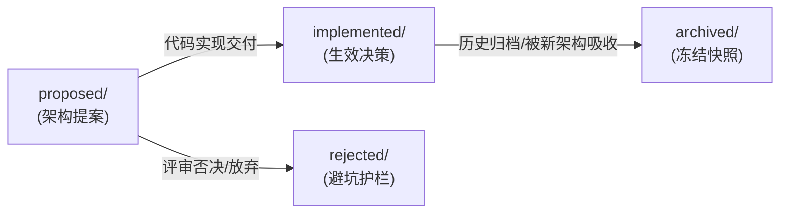

# Pi-Cordis 架构与设计决策记录 (Agent Notes)

[English](README.md) | 中文

本目录记录 **Pi-Cordis** 项目的架构决策记录（ADR）、技术选型、演进蓝图以及权衡取舍分析。

---

## 一、多级目录布局与含义

每份 Agent Note 在其文件路径中直接编码了两个正交维度：`{lifecycle}/{class}/yyyy-mm-dd-topic-title.zh.md`。

```text
.agents/notes/
├── proposed/                  # 待实施或正在评审的架构提案（尚未完全落地）
├── implemented/               # 已经完全实现并交付的架构决策
│   ├── architecture/          # 核心架构决策：微内核、服务矩阵、能力接缝、协议
│   ├── feature/               # 面向用户或模型的新能力（如新插件、TUI 交互组件）
│   ├── simplification/        # 精简决策：在不丢失能力的前提下消除代码/流程复杂度
│   ├── process/               # 工程流程、质量门禁、包管理与代码规范
│   ├── testing/               # 测试基础设施与自动化回归策略
│   └── bug-fix/               # 事故复盘与关键架构缺陷修复
├── rejected/                  # 经讨论被否决的提案（仅在具备防踩坑价值时保留）
└── archived/                  # 历史归档记录（决策已完全落地且后续无需再指导新演进）
    ├── architecture/
    └── simplification/
```

### 1. 一级维度：生命周期 (`{lifecycle}/`)
- **`proposed/`**：实施前评审的提案。使用将来时态表达预期设计（包含 `## Proposal`、`## Acceptance criteria`、`## Risks`）。
- **`implemented/`**：决策已交付到生产代码中。文件必须与代码真实实现保持一致（事实、路径、命名保持最新），使用现在时态（包含 `## Decision`、`## Consequences`）。
- **`rejected/`**：提案经过评审后被否决。状态标为 `Status: rejected — <一句话否决原因>`。仅当其决策理由能避免未来重复踩坑时保留。
- **`archived/`**：已完全落地的历史记录，其内容已被更新的架构决策吸收或不再指导未来演进。永久冻结。

### 2. 二级维度：决策分类 (`{class}/`)
| 类别 | 覆盖范围与界定 |
| :--- | :--- |
| `architecture` | 关乎交付源码的结构性决策：微内核机制、服务矩阵、能力接缝、RPC 协议等。 |
| `feature` | 面向用户或大模型的新功能特性与插件交互。 |
| `simplification` | 在不降低功能的前提下精简架构、移除冗余代码、解耦上游依赖。 |
| `process` | 围绕代码库的开发工具链、自动化脚本、工作流规范与文档体系。 |
| `testing` | 测试策略、Mock 机制、快照回放与覆盖率门禁。 |
| `bug-fix` | 影响深远的架构级缺陷修复与复盘。 |

---

## 二、变更推进与状态流转方法



### 1. 提案落地推进：`proposed/` -> `implemented/`
当某项提案的代码完成编写、通过单元测试并合并到主分支后：
1. **移动文件**：将文件从 `proposed/{topic}.md` 移动至 `implemented/{class}/{topic}.md`；
2. **更新状态**：将头部状态从 `Status: proposed` 改为 `Status: implemented`；
3. **正文重写**：
   - 将 `## Proposal`（拟议方案）重写为 `## Decision`（已落地决策，采用客观现在时态描述）；
   - 将 `## Acceptance criteria`（验收标准）与 `## Risks`（风险）折叠并入 `## Consequences`（架构影响与收益）或 `## Verification`（验证结果）；
   - 移除假设性的未来计划与迁移步骤，反映代码的真实交付形态。

### 2. 决策历史归档：`implemented/` -> `archived/`
当某项已实施的决策经过长期演进，其初期规格已被后续更完善的架构文档完全吸收，或者不再直接指导未来开发时：
1. **移动文件**：将文件从 `implemented/{class}/{topic}.md` 移动至 `archived/{class}/{topic}.md`（归档路径中省略 `implemented`）；
2. **插入归档时间**：在 `Status: implemented` 正下方紧跟插入 `Archived: YYYY-MM-DD` 元数据；
3. **永久冻结**：归档后的文档作为历史快照永久保留，不再进行二次编辑、翻译或重构。

### 3. 提案否决流程
若提案在评审阶段被否决：
1. **移动文件**：移入 `rejected/{class}/{topic}.md`；
2. **标明原因**：设置 `Status: rejected — <简要说明否决原因>`；
3. **留存准则**：仅保留具有代表性、容易被后来者重复尝试的错误方案；对于完全过时或无参考价值的提案，直接删除。

---

## 三、当前决策记录清单 (Working Inventory)

### 待评审与演进中提案 (`proposed/`)

*当前暂无待评审提案。*

---

### 已落地的决策记录 (`implemented/`)

#### 架构类决策 (`implemented/architecture/`)
| 制定日期 | 决策标题 | 核心关注点 |
|---|---|---|
| `2026-08-19` | [Pi-Cordis 基于 Cordis v4.0.1 的微内核架构演进](implemented/architecture/2026-08-19-pi-cordis-microkernel-architecture.zh.md) | “一切皆插件”设计哲学、Cordis 微内核底座、依赖隔离、100% 保持 Pi 原生 TUI 与功能对齐 |
| `2026-08-19` | [Pi-Cordis 服务矩阵与扩展生态融合](implemented/architecture/2026-08-19-pi-cordis-services-and-plugin-ecosystem.zh.md) | 10 大核心 Cordis 服务（`ctx.settings`, `ctx.auth`, `ctx.ai`, `ctx.tools`, `ctx.session`, `ctx.skills`, `ctx.prompts`, `ctx.extensions`, `ctx.packageManager`, `ctx.agent`）、`pi.dev/packages` 生态兼容 |
| `2026-08-19` | [Pi-Cordis TUI 与控制面重构的工程取舍分析](implemented/architecture/2026-08-19-pi-cordis-tui-and-control-plane-tradeoffs.zh.md) | 控制面重构与绞杀者模式的 4 大真实成本、TUI 静默启动与资源呈现仪表盘、字符终端中 UI 插件的本质障碍、7 插槽 TUI 架构演进与多智能体呈现边界 |
| `2026-08-19` | [Pi-Cordis 原生 Cordis 插件与预设配置文件设计](implemented/architecture/2026-08-19-pi-cordis-native-plugins-and-profiles.zh.md) | 独立插件工作区（`packages/plugins/*`）、原生插件开发范式与场景预设组合 |
| `2026-08-19` | [Pi-Cordis 原生插件生态全景规划与优先级演进矩阵](implemented/architecture/2026-08-19-pi-cordis-plugin-ecosystem-roadmap-and-priority.zh.md) | 70+ 扩展能力全景分类、P0 -> P1 -> P2 -> P3 优先级演进矩阵（Subagent、Plan mode、问答交互、输出防爆、会话压缩） |
| `2026-08-20` | [Pi-Cordis 加载器权衡与双轨 HMR 热重载架构](implemented/architecture/2026-08-20-pi-cordis-loader-and-dual-track-hmr-architecture.zh.md) | 核心服务编程式加载、YAML 配置与代码插件双轨热重载、ESM 时间戳缓存穿透与会话连续性保持 |
| `2026-08-20` | [Pi-Cordis 能力接缝、显式注入 (inject) 与 TUI 交互桥接设计](implemented/architecture/2026-08-20-pi-cordis-capability-seams-inject-and-tui-bridge.zh.md) | DSH 三位一体能力接缝标准、Cordis v4 inject 显式沙箱与乱序拓扑解析、ExtensionService 7 大 TUI 交互槽位 |
| `2026-08-20` | [Pi-Cordis “注册即副作用，副作用必可逆” 与 Disposer 模式深度实践](implemented/architecture/2026-08-20-pi-cordis-reversible-side-effects-and-disposer-pattern.zh.md) | 可逆副作用公理、超越 HMR 的 4 大核心业务场景（预设动态切换、Subagent 临时沙箱、Plan mode 只读切换、操作原子回滚） |
| `2026-08-20` | [Pi-Cordis 编程化工具调用（PTC / Code Mode）架构设计](implemented/architecture/2026-08-20-pi-cordis-ptc-code-mode-architecture-proposal.zh.md) | DSH Code Mode 深度拆解、轮次坍缩与上下文保护、动态 SDK 生成与 `presets/ptc/` 落地 |
| `2026-08-20` | [Pi-Cordis 极简设计哲学与 “Default is Best” 预设体系重构](implemented/architecture/2026-08-20-pi-cordis-minimalist-presets-and-default-is-best-philosophy.zh.md) | 废除 5 大内部实现排列组合、回归 Pi 极简灵魂、默认即最佳、3 大场景化 Agent 模式 |
| `2026-08-20` | [Pi-Cordis 全套内置插件最优解架构演进蓝图与实践指南](implemented/architecture/2026-08-20-pi-cordis-plugin-ecosystem-optimal-architecture-and-roadmap.zh.md) | 插件最优解 5 大核心准则、15 个内置插件全量对齐矩阵与三阶段交付总结 |
| `2026-08-20` | [Pi-Cordis 智能体自我认知（Self-Inspection）架构演进与知识沉淀](implemented/architecture/2026-08-20-pi-cordis-agent-self-inspection-and-introspection-architecture.zh.md) | 100% 继承 Pi 原生自省传统、5 维自我认知模型、rules-injector SHA-256 KV-Cache 保护、10 大服务运行时反射与 /profile 预设自检 |
| `2026-08-20` | [Pi-Cordis 双向工具桥接中枢、Profile 动态工具遮罩与终端交互式 UI 规范](implemented/architecture/2026-08-20-pi-cordis-bidirectional-tool-bridge-and-interactive-ui.zh.md) | 避免 CLI `--tools` 白名单过滤副作用、ExtensionService 统一桥接搜索工具与插件工具、Profile 热切换插件生命周期卸载与 `pi.setActiveTools` 动态遮罩同步、`ask_question` 真实终端阻塞式多选弹窗与自定义输入规范 |

#### 特性与扩展类决策 (`implemented/feature/`)
| 制定日期 | 决策标题 | 核心关注点 |
|---|---|---|
| `2026-08-20` | [基于极简哲学的 Pi-Cordis 原生 Subagent 插件精准增强实现](implemented/feature/2026-08-20-pi-cordis-subagent-plugin-lean-enhancement.zh.md) | 拒绝复刻 130+ 文件重型巨石，以不到 50 行增量原地落地 `ctx.session.inMemory()` 物理会话隔离与 `scout`/`worker` 角色工具切片 |
| `2026-08-20` | [基于极简哲学的 rpiv-mono 优秀特性吸收与轻量演进实现](implemented/feature/2026-08-20-pi-cordis-rpiv-mono-lean-feature-absorption.zh.md) | 拒绝插件碎片化拆包，以不到 100 行增量原地交付零污染 `/btw` 指令、问答 Markdown 预览、Todo 依赖环路检测与 OSC 777 终端通知 |
| `2026-08-20` | [终端斜杠命令原生插件化与零污染旁路问答架构重构](implemented/feature/2026-08-20-pi-cordis-native-slash-commands-and-ephemeral-btw-architecture.zh.md) | ExtensionService 双向命令桥接中心、@pi-cordis/profiles 与 @pi-cordis/plugin-btw 纯正 Cordis 插件化、真实单轮 LLM 旁路流式问答与 100% 物理隔离 |

#### 精简类决策 (`implemented/simplification/`)
| 制定日期 | 决策标题 | 核心关注点 |
|---|---|---|
| `2026-08-19` | [Pi-Cordis 代码库精简与上游解耦架构方案](implemented/simplification/2026-08-19-pi-cordis-repository-simplification.zh.md) | 移除 1200+ 重复源码文件，全面接入 `@earendil-works/pi-*` 官方 npm 包，代码库体积缩减 85%+，实现零成本跟踪上游演进 |
| `2026-08-20` | [Pi-Cordis 核心层 (@pi-cordis/core) 上游彻底解耦与 4 层架构重构落地](implemented/simplification/2026-08-20-pi-cordis-core-decoupling-and-layered-architecture.zh.md) | 终结最后一公里代码克隆，确立 4 层架构金字塔，重构为 `@pi-cordis/core` 并直接消费 npm 官方 `@earendil-works/pi-coding-agent`，交付 `picds` 独立命令与 `~/.picds` 用户隔离 |

---

### 历史归档记录 (`archived/`)

#### 架构类归档 (`archived/architecture/`)
| 制定日期 | 决策标题 | 归档原因与说明 |
|---|---|---|
| `2026-08-19` | [Pi AgentHarness 工业级事务规格与 Cordis 微内核架构融合](archived/architecture/2026-08-19-pi-agent-harness-specification-and-cordis-integration.zh.md) | 已归档（初期探索性规格文档，已被后续完善的微内核服务矩阵与能力接缝架构完全吸收与继承） |
