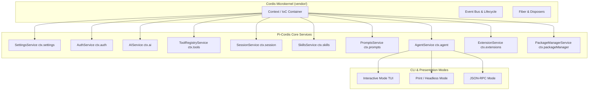

# Agent Note: Pi-Cordis Microkernel Architecture on Cordis v4.0.1

Status: implemented

## Problem

The original [`earendil-works/pi`](https://github.com/earendil-works/pi) codebase was built with procedural class assembly where subsystem services (model runtime, settings, auth, session management, resource loader, tools) were manually instantiated and plumbed through monolithic option objects. While this approach provided simple initial wiring, it lacked:
1. A unified inversion-of-control (IoC) container and plugin lifecycle management mechanism.
2. Standardized service declaration and dynamic dependency injection.
3. Clean boundaries between core capabilities and external extensibility without monolithic parameter passing.

At the same time, we required that the project must not take dependencies on DeepSeek Harness (`@deepseek-ai/dsh-*`) domain-specific plugins, but must strictly build on the generic Cordis meta-framework kernel under `vendor/` while preserving 100% of Pi's native CLI usage, commands, and interactive terminal UI (Canvas, diff viewer, selectors, etc.).

## Decision

We restructured the Pi coding agent into **Pi-Cordis** based on **Cordis (v4.0.1)**, adopting the **"Everything is a plugin"** design philosophy:

1. **Vendored Cordis as Sole Meta-Framework Kernel**:
   - The workspace links directly to `vendor/cordis`, `vendor/cosmokit`, `vendor/schemastery`, and other foundation modules under `vendor/`.
   - Zero dependency on `@deepseek-ai/dsh-*` packages.
2. **Typed Context Augmentation & Declaration Merging**:
   - Augmented Cordis `Context` with strongly-typed service accessors (`ctx.settings`, `ctx.auth`, `ctx.ai`, `ctx.tools`, `ctx.session`, `ctx.skills`, `ctx.prompts`, `ctx.extensions`, `ctx.packageManager`, `ctx.agent`).
   - Extended `Events` map for application lifecycles (`pi/session-start`, `pi/session-before`, `pi/session-after`, `pi/tool-call`, `pi/tool-result`, `pi/model-change`, `pi/prompt-transform`).
3. **Application Bootstrap via `createPiContext()`**:
   - Encapsulated kernel initialization into `createPiContext(options)`, mounting all core services as Cordis plugins.
   - Sits beneath interactive TUI, print mode, JSON event stream mode, and RPC mode.

## Microkernel Architecture & Bootstrapping

## Alternatives considered

- **Reusing DSH Plugins (`@deepseek-ai/dsh-*`)**:
  - *Why not*: DSH plugins are tightly coupled with the DSH BFF server, Typert RPC, and micro-frontend UI slots. Using them would distort Pi's lightweight TUI-centric interaction and break direct alignment with Pi's standalone CLI contracts.
- **Keeping Monolithic Procedural Gluing without Cordis Service Subclasses**:
  - *Why not*: Merely instantiating classes procedurally would fail to realize the "Everything is a plugin" design philosophy, missing out on Cordis's lifecycle events, scoped context isolation, and fiber management.

## Consequences

- **Benefits**:
  - Full modularity with clean service boundaries registered on `ctx`.
  - 100% preservation of Pi's native CLI, interactive TUI, and full model catalog (1307+ models).
  - Clean separation of concern with complete testability of microkernel bootstrap (`cordis-bootstrap.test.ts`).
- **Trade-offs**:
  - Subsystems must declare `static provide` and adhere to Cordis lifecycle patterns.
  - Microtask settlement (`await Promise.resolve()`) is required during bootstrap for fiber effect completion.
