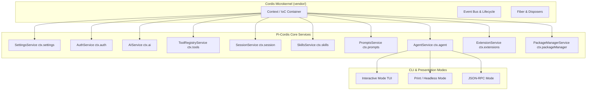

# Agent Note: Pi-Cordis 基于 Cordis v4.0.1 的微内核架构设计

Status: implemented

## Problem

原始的 [`earendil-works/pi`](https://github.com/earendil-works/pi) 代码库采用过程式的类装配方式，模型运行时、设置管理、凭证鉴权、会话管理、资源加载与工具集等各个子系统通过庞大的选项对象进行手工实例化与传递。这种方式虽然初始简单，但存在以下缺陷：
1. 缺乏统一的依赖注入（IoC）容器与插件生命周期管理机制；
2. 缺乏标准化的服务声明与动态依赖注入体系；
3. 核心能力与外部扩展之间边界不清晰，容易产生巨型参数传递。

同时，我们明确要求该工程不得直接依赖 DeepSeek Harness（`@deepseek-ai/dsh-*`）专属业务插件，必须纯净地基于 `vendor/` 下的通用 Cordis 元框架内核，并在保持微内核插件化重构的同时，100% 还原 Pi 的原生 CLI 参数、指令与交互式终端 UI（Canvas、差异化渲染、分支树选择器、Diff 对比等）。

## Decision

我们将 Pi 智能体全面重构为 **Pi-Cordis**，基于 **Cordis (v4.0.1)** 践行 **“Everything is a plugin”** 的设计哲学：

1. **仅依赖 Vendored Cordis 作为元框架内核**：
   - 工作区直接链接 `vendor/cordis`、`vendor/cosmokit`、`vendor/schemastery` 等底层基础库；
   - 零引入 `@deepseek-ai/dsh-*` 专属插件。
2. **强类型 Context 声明合并与生命周期事件总线**：
   - 通过 TypeScript 声明合并对 Cordis `Context` 进行类型扩充（`ctx.settings`, `ctx.auth`, `ctx.ai`, `ctx.tools`, `ctx.session`, `ctx.skills`, `ctx.prompts`, `ctx.extensions`, `ctx.packageManager`, `ctx.agent`）；
   - 定义应用级生命周期事件集（`pi/session-start`、`pi/session-before`、`pi/session-after`、`pi/tool-call`、`pi/tool-result`、`pi/model-change`、`pi/prompt-transform`）。
3. **基于 `createPiContext()` 的统一应用引导**：
   - 将内核初始化统一封装为 `createPiContext(options)`，自动将所有核心服务挂载为 Cordis 插件；
   - 作为交互式 TUI、打印模式、JSON 事件流模式与 RPC 模式的统一底层中枢。

## Microkernel Architecture & Bootstrapping

## Alternatives considered

- **直接复用 DSH 官方插件 (`@deepseek-ai/dsh-*`)**：
  - *为什么不采用*：DSH 插件与 DSH 的 BFF 服务端、Typert RPC 和微前端插槽强绑定。引入它们会破坏 Pi 极简纯粹的 TUI 终端交互体验与独立的 CLI 命令行契约。
- **保留过程式粘合代码而不使用 Cordis Service 类**：
  - *为什么不采用*：单纯的过程式实例化无法享受 Cordis 的微内核生命周期、上下文隔离（Context Isolation）以及 Fiber 纤程销毁机制，背离了“Everything is a plugin”的设计初心。

## Consequences

- **收益 (Benefits)**：
  - 模块间实现高内聚、低耦合，通过 `ctx` 实现清晰的服务治理；
  - 100% 保持了 Pi 的原生命令行交互、TUI 体验与全量模型目录（1307+ 个模型）；
  - 具备独立且高效的微内核单元测试体系（`cordis-bootstrap.test.ts`）。
- **权衡 (Trade-offs)**：
  - 各服务类必须显式声明 `static provide` 并遵循 Cordis 生命周期规范；
  - 引导启动时需等待微任务队列沉淀（`await Promise.resolve()`）以确保纤程 Effect 生效。
