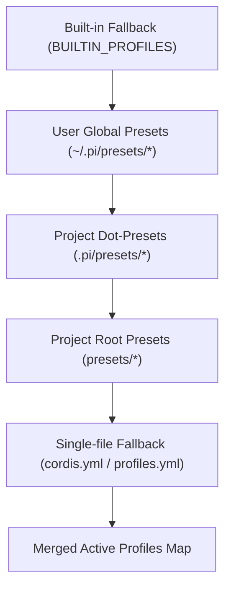

# Agent Note: Pi-Cordis Native Cordis Plugins, Standalone Presets Directory, and Profile Presets

Status: implemented
Created: 2026-08-19

English | [中文](2026-08-19-pi-cordis-native-plugins-and-profiles.zh.md)

## Executive Summary

This Architecture Decision Record (ADR) documents the design and implementation of **Native Cordis Plugins**, the **Standalone Presets Directory**, and the **Profile Preset System** in `pi-cordis`:
1. **Dedicated Plugin Workspace (`packages/plugins/*`)**: Adopting a modular monorepo layout where every plugin lives as an autonomous subpackage;
2. **Four Native Cordis Plugins**:
   - `@pi-cordis/plugin-safety-gate`: Intercepts high-risk shell commands and sensitive file modifications;
   - `@pi-cordis/plugin-git-guard`: Provides workspace dirty warnings and automatic git checkpoints;
   - `@pi-cordis/plugin-todo-tracker`: Provides `todo_write`/`todo_read` tools and active task prompt injection;
   - `@pi-cordis/plugin-rules-injector`: Auto-discovers project rules (`AGENTS.md`, `.claude/rules/*.md`, `.cursorrules`) and injects them into system prompts;
3. **Standalone Presets Directory & Declarative YAML (Aligned with `pi-dsh/presets`)**:
   - Root-level `presets/` directory layout with dedicated subfolders for each preset;
   - Each preset contains `preset.yml` (metadata) and `cordis.yml` (plugin composition);
   - Automatic cascading discovery across project-level (`presets/`, `.pi/presets/`) and user-level (`~/.pi/presets/`);
4. **Interactive TUI Switching**: View, autocomplete, and switch profiles live in the interactive terminal via the `/profile` slash command.

---

## Directory Layout

```text
pi-cordis/
├── presets/                          # 🌟 Standalone Agent Presets & Profiles Directory
│   ├── README.md                     # Presets guide & documentation
│   ├── default/                      # Default daily coding preset
│   │   ├── preset.yml                # Display name & description
│   │   └── cordis.yml                # Mounts rules-injector + todo-tracker
│   ├── safe/                         # Safe engineering preset
│   │   ├── preset.yml
│   │   └── cordis.yml                # Mounts safety-gate + git-guard + rules + todo
│   ├── strict/                       # Strict read-only audit preset
│   │   ├── preset.yml
│   │   └── cordis.yml                # Mounts safety-gate (read-only) + git-guard + rules
│   ├── full/                         # Full power-user preset
│   │   ├── preset.yml
│   │   └── cordis.yml                # Mounts all 4 native plugins
│   └── minimal/                      # Minimal microkernel baseline
│       ├── preset.yml
│       └── cordis.yml                # Zero extra plugins
│
└── packages/plugins/                 # 🌟 Native Cordis Plugin Packages
    ├── safety-gate/                  # @pi-cordis/plugin-safety-gate
    │   ├── package.json
    │   └── src/index.ts              # High-risk command and path interceptor
    ├── git-guard/                    # @pi-cordis/plugin-git-guard
    │   ├── package.json
    │   └── src/index.ts              # Git checkpoints and status guard
    ├── todo-tracker/                 # @pi-cordis/plugin-todo-tracker
    │   ├── package.json
    │   └── src/index.ts              # Task management tools and prompt injection
    ├── rules-injector/               # @pi-cordis/plugin-rules-injector
    │   ├── package.json
    │   └── src/index.ts              # Project rules discovery and injection
    └── profiles/                     # @pi-cordis/profiles
        ├── package.json
        └── src/index.ts              # Presets loader, YAML parser, and profile assembler
```

---

## Preset Specification (`presets/<name>/`)

Each preset folder contains two standard YAML declarations:

### 1. `preset.yml` — Metadata
```yaml
name: Safe Engineering Mode (Safe)
description: Enhanced safety with destructive command blocking, sensitive path protection, and automatic git checkpoints.
```

### 2. `cordis.yml` — Plugin Composition
```yaml
# Mount safety-gate with custom protected paths
- name: '@pi-cordis/plugin-safety-gate'
  config:
    protectedPaths:
      - .env
      - .env.local
      - .git/
      - id_rsa
      - node_modules/

# Mount git-guard with automatic checkpoints
- name: '@pi-cordis/plugin-git-guard'
  config:
    autoCheckpoint: true
    warnDirtyOnStart: true

# Mount rules-injector and todo-tracker
- name: '@pi-cordis/plugin-rules-injector'
- name: '@pi-cordis/plugin-todo-tracker'
```

---

## Cascading Discovery Workflow

`loadProfilesFromYaml(cwd, agentDir)` performs multi-tier cascading discovery:



---

## Benefits

1. **Declarative & High Cohesion**: Zero hardcoded profile lists in source code; capabilities are 100% declared in dedicated YAML files;
2. **Aligned with DSH / Pi Industrial Philosophy**: Mirrors the folder structure and clean separation found in `pi-dsh/presets`;
3. **Zero-Code Customization**: Users and teams can craft custom presets simply by creating a folder in `presets/` without compiling TypeScript;
4. **Seamless Interactive Control**: Real-time switching via `/profile` slash command in the interactive TUI.
