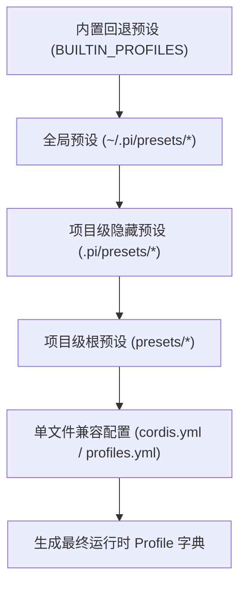

# Agent Note: Pi-Cordis 原生 Cordis 插件体系、独立 Presets 目录与 Profile 预设机制

Status: implemented
Created: 2026-08-19

[English](2026-08-19-pi-cordis-native-plugins-and-profiles.md) | 中文

## 摘要 (Executive Summary)

本篇架构决策记录（ADR）详细记录了在 `pi-cordis` 中构建**原生 Cordis 插件集合（Native Cordis Plugins）**与**独立 Presets 目录预设装配体系**的设计与实现：
1. **独立插件包工作区（`packages/plugins/*`）**：采用模块化 Monorepo 规范，每个插件独立为一个自治的子包；
2. **四大原生 Cordis 插件**：
   - `@pi-cordis/plugin-safety-gate`：拦截高危破坏性 Shell 命令与敏感文件修改；
   - `@pi-cordis/plugin-git-guard`：提供 Git 工作区脏状态提示与关键轮次自动 Checkpoint 保护；
   - `@pi-cordis/plugin-todo-tracker`：提供 `todo_write`/`todo_read` 待办工具与活跃任务动态注入；
   - `@pi-cordis/plugin-rules-injector`：自动扫描项目规则文件（`AGENTS.md`, `.claude/rules/*.md`, `.cursorrules`）并注入系统提示词；
3. **独立 Presets 目录与声明式 YAML 装配（类似 `pi-dsh/presets`）**：
   - 建立根目录 `presets/` 独立子目录架构；
   - 每个预设拥有专属的 `preset.yml`（元数据）与 `cordis.yml`（插件装配清单）；
   - 支持项目级（`presets/`、`.pi/presets/`）与全局级（`~/.pi/presets/`）自动扫描合并；
4. **TUI 交互式热切换**：支持在交互式终端中通过 `/profile` 斜杠命令即时查看、选择与切换当前 Profile。

---

## 架构设计与目录布局

```text
pi-cordis/
├── presets/                          # 🌟 独立 Agent 能力与 Profile 预设目录
│   ├── README.md                     # 预设使用与扩展指南
│   ├── default/                      # 标准日常开发预设
│   │   ├── preset.yml                # 预设名称与描述
│   │   └── cordis.yml                # 挂载 rules-injector + todo-tracker
│   ├── safe/                         # 安全生产工程预设
│   │   ├── preset.yml
│   │   └── cordis.yml                # 挂载 safety-gate + git-guard + rules + todo
│   ├── strict/                       # 严格审计只读预设
│   │   ├── preset.yml
│   │   └── cordis.yml                # 挂载 safety-gate (只读) + git-guard + rules
│   ├── full/                         # 全能极客预设
│   │   ├── preset.yml
│   │   └── cordis.yml                # 挂载全部 4 大原生插件
│   └── minimal/                      # 极简微内核预设
│       ├── preset.yml
│       └── cordis.yml                # 零额外插件
│
└── packages/plugins/                 # 🌟 原生 Cordis 插件集合
    ├── safety-gate/                  # @pi-cordis/plugin-safety-gate
    │   ├── package.json
    │   └── src/index.ts              # 高危命令与路径拦截器
    ├── git-guard/                    # @pi-cordis/plugin-git-guard
    │   ├── package.json
    │   └── src/index.ts              # Git 检查点与状态守护
    ├── todo-tracker/                 # @pi-cordis/plugin-todo-tracker
    │   ├── package.json
    │   └── src/index.ts              # 任务清单工具与提示词注入
    ├── rules-injector/               # @pi-cordis/plugin-rules-injector
    │   ├── package.json
    │   └── src/index.ts              # 项目规则自动发现与注入
    └── profiles/                     # @pi-cordis/profiles
        ├── package.json
        └── src/index.ts              # Presets 目录动态扫描、YAML 解析与装配中枢
```

---

## 预设目录与文件规范 (`presets/<name>/`)

每个预设子目录包含两份标准的声明式 YAML 文件：

### 1. `preset.yml` — 预设元数据
```yaml
name: 安全生产工程模式 (Safe)
description: 强化安全防护，阻断高危破坏性命令与敏感文件篡改，开启 Git 自动检查点保护。
```

### 2. `cordis.yml` — 插件装配清单
```yaml
# 挂载 safety-gate 并配置受保护路径
- name: '@pi-cordis/plugin-safety-gate'
  config:
    protectedPaths:
      - .env
      - .env.local
      - .git/
      - id_rsa
      - node_modules/

# 挂载 git-guard 并启用自动检查点
- name: '@pi-cordis/plugin-git-guard'
  config:
    autoCheckpoint: true
    warnDirtyOnStart: true

# 挂载规则注入与待办追踪
- name: '@pi-cordis/plugin-rules-injector'
- name: '@pi-cordis/plugin-todo-tracker'
```

---

## 级联探测与加载流程 (Cascading Discovery)

`loadProfilesFromYaml(cwd, agentDir)` 按以下优先级级联扫描并深度合并预设：



1. **零代码修改扩展**：用户若需添加新角色（如 `reviewer`），只需创建 `presets/reviewer/` 并放置 `preset.yml` 和 `cordis.yml`；
2. **即时热感知**：在交互式终端中执行 `/profile` 或按 Tab 键，新增的预设将自动呈现在补全列表与交互下拉菜单中。

---

## 架构收益 (Benefits)

1. **声明式与高内聚**：彻底摒弃代码内死编码，预设与插件关系 100% 声明化于独立文件夹中；
2. **对齐 DSH / Pi 工业级规范**：完全契合 `pi-dsh/presets` 的目录治理哲学，具备极高的一致性与可维护性；
3. **极简扩展体验**：第三方开发者与用户无需学习 TypeScript 内部装配逻辑，通过标准 YAML 即可随心定制工作流；
4. **运行时热切换**：终端 `/profile` 命令直接与微内核事件总线联动，随时无缝切换安全等级与插件工具链。
