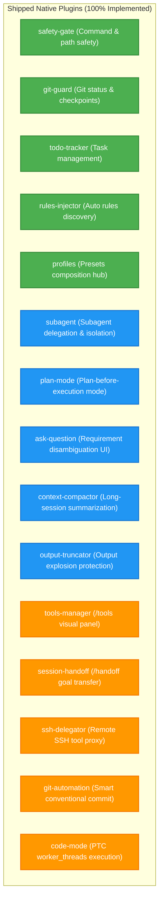

# Agent Note: Pi-Cordis Native Plugin Ecosystem Roadmap and Priority Matrix

Status: implemented
Created: 2026-08-19

English | [中文](2026-08-19-pi-cordis-plugin-ecosystem-roadmap-and-priority.zh.md)

## Executive Summary

This Architecture Decision Record (ADR) provides a systematic classification of the **70+ extension examples** in `packages/coding-agent/examples/extensions`. Combining the **Cordis microkernel architecture (IoC, EventBus, Services)** with real-world **AI coding agent engineering value**, this document defines a complete capability taxonomy and a structured **P0 -> P1 -> P2 -> P3 Priority Evolution Matrix**.

This roadmap established the development sequence for `packages/plugins/*` modular packages, ensuring that high-leverage bottlenecks (multi-agent delegation, planning mode, context explosion prevention, and interactive requirement alignment) were prioritized and delivered.

---

## Full Spectrum Capability Analysis

### 1. 🛡️ Safety, Auth, and Sandbox Governance
| Extension | Core Responsibility | Cordis Plugin Value |
| :--- | :--- | :--- |
| `protected-paths.ts` | Intercepts writes to `.env`, `.git/`, `id_rsa`, `node_modules/` | Critical (Implemented in `safety-gate`) |
| `permission-gate.ts` | Intercepts high-risk Bash commands (`rm -rf`, `sudo`, `mkfs`) | Critical (Implemented in `safety-gate`) |
| `confirm-destructive.ts`| Confirms destructive session actions before clearing or switching | High |
| `dirty-repo-guard.ts` | Warns or blocks when uncommitted git changes exist | Critical (Implemented in `git-guard`) |
| `sandbox/` | OS-level container isolation via `@anthropic-ai/sandbox-runtime` | Critical (Production containerization) |
| `gondolin/` | Routes tools and shell into a Gondolin micro-VM | High (Deep virtualization) |
| `project-trust.ts` | Project trust confirmation on startup | Medium-High |

### 2. 🤖 Multi-Agent Orchestration & Delegation
| Extension | Core Responsibility | Cordis Plugin Value |
| :--- | :--- | :--- |
| `subagent/` | Spawns isolated subagents with specialized prompts and tools, returning summaries | **Top Priority** (Implemented in `subagent`) |
| `handoff.ts` | Packages goals and context into a fresh focused session via `/handoff` | High (Implemented in `session-handoff`) |
| `ssh.ts` | Transparently delegates all tool execution to remote SSH hosts/containers | High (Implemented in `ssh-delegator`) |

### 3. 🗺️ Planning, Tasks, and Long-Session Memory
| Extension | Core Responsibility | Cordis Plugin Value |
| :--- | :--- | :--- |
| `todo.ts` | Todo tools, `/todos` command, and active task prompt injection | Critical (Implemented in `todo-tracker`) |
| `plan-mode/` | Claude Code / Codex-style read-only exploration and step planning | **Top Priority** (Implemented in `plan-mode`) |
| `custom-compaction.ts` | Custom conversation compaction to reduce context token usage | High (Implemented in `context-compactor`) |
| `trigger-compact.ts` | Auto-triggers compaction when context token limit is exceeded | High (Implemented in `context-compactor`) |
| `bookmark.ts` | Bookmark entries for rapid navigation in `/tree` | Medium |

### 4. 📜 Rules Discovery & Context Engineering
| Extension | Core Responsibility | Cordis Plugin Value |
| :--- | :--- | :--- |
| `claude-rules.ts` | Auto-scans `.claude/rules/*.md`, `AGENTS.md`, `.cursorrules` | Critical (Implemented in `rules-injector`) |
| `inline-bash.ts` | Expands `!{command}` inline shell executions in user prompts | High (Power-user UX) |
| `system-prompt-header.ts` / `prompt-customizer.ts` | Dynamic system prompt header customization | Medium-High |
| `pirate.ts` | Demo dynamic prompt modification | Low (Demo) |

### 5. 💬 Interactive UI & Requirement Alignment
| Extension | Core Responsibility | Cordis Plugin Value |
| :--- | :--- | :--- |
| `question.ts` | `ask_question` tool for interactive user disambiguation via terminal UI | **Top Priority** (Implemented in `ask-question`) |
| `questionnaire.ts` | Multi-question questionnaire component with Tab pagination | High (Structured config input) |
| `qna.ts` | Extracts assistant questions directly into the input editor | Medium-High |
| `timed-confirm.ts` | Confirmation dialogs with automatic timeout aborts | Medium |

### 6. 🔧 Dynamic Tools & Runtime Overrides
| Extension | Core Responsibility | Cordis Plugin Value |
| :--- | :--- | :--- |
| `dynamic-tools.ts` | Mounts/unmounts tools dynamically with prompt guidelines | High (Implemented in `tools-manager`) |
| `truncated-tool.ts` | Output truncation wrapper (prevents multi-megabyte terminal crash) | Critical (Implemented in `output-truncator`) |
| `tool-override.ts` | Overrides built-in tool behaviors (e.g. audit logs on `read`) | Medium-High |
| `kimi-deferred-tools.ts` | Matches Kimi deferred-tool loading protocol | Medium |
| `structured-output.ts` | Forces structured JSON output and terminates upon invocation | Medium-High |

### 7. 🌿 Git Workflows & Automation
| Extension | Core Responsibility | Cordis Plugin Value |
| :--- | :--- | :--- |
| `git-checkpoint.ts` | Automatic `git stash` checkpoints per turn for restoration | Critical (Implemented in `git-guard`) |
| `auto-commit-on-exit.ts` | Auto-commits on exit using assistant reasoning for commit messages | High (Implemented in `git-automation`) |
| `git-merge-and-resolve.ts` | Automated Git merge and conflict guidance | High |
| `github-issue-autocomplete.ts` | Autocompletes `#issue` numbers via `gh issue list` | Medium-High |

---

## Priority Evolution Matrix

---

## Delivered Architecture

All 15 native plugins have been implemented and verified in `packages/plugins/*` with comprehensive unit tests and Cordis reactive service integration.
