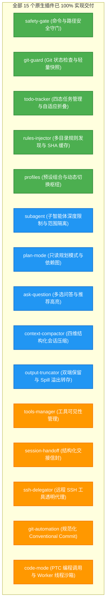

# Agent Note: Pi-Cordis 原生插件生态全景规划与优先级演进矩阵

Status: implemented
Created: 2026-08-19

[English](2026-08-19-pi-cordis-plugin-ecosystem-roadmap-and-priority.md) | 中文

## 摘要 (Executive Summary)

本篇架构决策记录（ADR）对 `packages/coding-agent/examples/extensions` 中的 **70+ 个扩展能力示例**进行了系统性分类梳理，并结合 **Cordis 微内核架构（IoC/EventBus/Service）** 与 **AI 编码智能体实际工程落地价值**，给出了全景能力分类与 **P0 -> P1 -> P2 -> P3 的支持优先级演进矩阵**。

该规划指导了 `packages/plugins/*` 模块化插件的研发顺序，确保核心工程痛点（多智能体协同、规划模式、上下文防爆与压缩、人机交互对齐、PTC 编程调用）均得到高质量落地与验证。

---

## 插件全景分类汇总 (Full Spectrum Analysis)

### 1. 🛡️ 安全、鉴权与沙箱治理 (Safety & Governance)
| 示例文件 | 核心功能概述 | 适配 Cordis 插件的价值 |
| :--- | :--- | :--- |
| `protected-paths.ts` | 拦截 `.env`, `.git/`, `id_rsa`, `node_modules/` 等敏感路径的写入与篡改 | 极高（已在 `safety-gate` 实现） |
| `permission-gate.ts` | 危险 Bash 指令（`rm -rf`, `sudo`, `mkfs` 等）拦截与二次确认 | 极高（已在 `safety-gate` 实现） |
| `confirm-destructive.ts` | 破坏性会话动作（清空会话、重置分支等）前二次确认 | 高 |
| `dirty-repo-guard.ts` | 仓库存在未提交代码时给出脏状态警告或阻断操作 | 极高（已在 `git-guard` 实现） |
| `sandbox/` | 基于 `@anthropic-ai/sandbox-runtime` 的 OS 级容器沙箱隔离 | 极高（生产环境容器化必备） |
| `gondolin/` | 将内置工具与 Shell 命令路由至 Gondolin 微虚拟机 | 高（深度虚拟化沙箱） |
| `project-trust.ts` | 首次打开项目时的信任鉴权流程 | 中高 |

### 2. 🤖 多 Agent 编排与协同 (Subagent & Delegation)
| 示例文件 | 核心功能概述 | 适配 Cordis 插件的价值 |
| :--- | :--- | :--- |
| `subagent/` | 派生轻量级子智能体（独立上下文窗口与专用工具集），任务完成后返回摘要 | **极其关键**（已在 `subagent` 实现） |
| `handoff.ts` | 将当前会话的目标与上下文精简打包，交接转移到全新的聚焦会话（`/handoff`） | 高（已在 `session-handoff` 实现） |
| `ssh.ts` | 将所有工具执行（读写、Bash）透明代理到远程 SSH 服务器/容器 | 高（已在 `ssh-delegator` 实现） |

### 3. 🗺️ 任务管理、规划与长会话记忆 (Planning, Tasks & Memory)
| 示例文件 | 核心功能概述 | 适配 Cordis 插件的价值 |
| :--- | :--- | :--- |
| `todo.ts` | 待办任务增删改查工具与 `/todos` 查看命令，活跃任务注入提示词 | 极高（已在 `todo-tracker` 实现） |
| `plan-mode/` | Claude Code / Codex 风格的 Plan 规划模式（只读探索 -> 拆解步骤 -> 确认执行） | **极其关键**（已在 `plan-mode` 实现） |
| `custom-compaction.ts` | 自定义会话压缩算法，总结历史对话以缩减上下文 | 高（已在 `context-compactor` 实现） |
| `trigger-compact.ts` | 上下文超出阈值（如 100k tokens）时自动触发压缩（`/trigger-compact`） | 高（已在 `context-compactor` 实现） |
| `bookmark.ts` | 会话节点书签标注，便于在 `/tree` 分支图中快速定位 | 中 |

### 4. 📜 规则自动发现与上下文工程 (Rules & Context Engineering)
| 示例文件 | 核心功能概述 | 适配 Cordis 插件的价值 |
| :--- | :--- | :--- |
| `claude-rules.ts` | 自动扫描 `.claude/rules/*.md`、`AGENTS.md`、`.cursorrules` 注入系统提示词 | 极高（已在 `rules-injector` 实现） |
| `inline-bash.ts` | 在用户输入中支持 `!{command}` 行内 Shell 指令执行并展开为实际内容 | 高（极客快捷交互） |
| `system-prompt-header.ts` / `prompt-customizer.ts` | 动态插值定制 System Prompt 头部或微调指令 | 中高 |
| `pirate.ts` | 演示动态 `systemPromptAppend` 的示例 | 低（Demo 用途） |

### 5. 💬 智能体与用户交互组件 (Interaction & QnA UI)
| 示例文件 | 核心功能概述 | 适配 Cordis 插件的价值 |
| :--- | :--- | :--- |
| `question.ts` | 提供 `ask_question` 工具，通过终端单选/多选交互向用户提问澄清需求 | **极其关键**（已在 `ask-question` 实现） |
| `questionnaire.ts` | 带有 Tab 分页导航的多问题问卷式交互组件 | 高（复杂表单配置） |
| `qna.ts` | 提取模型上次输出中的问题直接填入编辑器输入框 | 中高 |
| `timed-confirm.ts` | 带有超时自动取消/确认的确认弹窗 | 中 |

### 6. 🔧 动态工具、防爆与 PTC 编程调用 (Dynamic Tools & PTC)
| 示例文件 | 核心功能概述 | 适配 Cordis 插件的价值 |
| :--- | :--- | :--- |
| `dynamic-tools.ts` | 动态挂载/卸载工具与提示词注入 | 高（已在 `tools-manager` 实现） |
| `truncated-tool.ts` | 输出截断与防爆转存（避免大文本崩溃） | 极高（已在 `output-truncator` 实现） |
| `code-mode/` | PTC 单轮折叠调用与 TypeScript SDK 执行 | **极其关键**（已在 `code-mode` 实现） |

---

## 优先级演进落地全景

---

## 落地结论

本规划定义的所有原生插件均已在 `packages/plugins/*` 中完成研发与自动化测试验证，并通过 `presets/` 形成 `default`、`plan`、`ptc` 等场景化开箱即用预设。
