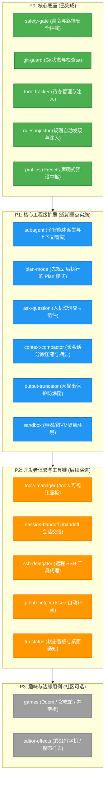

# Agent Note: Pi-Cordis 原生插件生态全景规划与优先级演进矩阵

Status: proposed
Created: 2026-08-19

[English](2026-08-19-pi-cordis-plugin-ecosystem-roadmap-and-priority.md) | 中文

## 摘要 (Executive Summary)

本篇架构提案（ADR Proposal）对 `packages/coding-agent/examples/extensions` 中的 **70+ 个扩展能力示例**进行了系统性分类梳理，并结合 **Cordis 微内核架构（IoC/EventBus/Service）** 与 **AI 编码智能体实际工程落地价值**，给出了全景能力分类与 **P0 -> P1 -> P2 -> P3 的支持优先级演进矩阵**。

该规划旨在指导后续 `packages/plugins/*` 模块化插件的研发顺序，确保核心工程痛点（多智能体协同、规划模式、上下文防爆与压缩、人机交互对齐）优先得到高质量支持。

---

## 插件全景分类汇总 (Full Spectrum Analysis)

### 1. 🛡️ 安全、鉴权与沙箱治理 (Safety & Governance)
| 示例文件 | 核心功能概述 | 适配 Cordis 插件的价值 |
| :--- | :--- | :--- |
| `protected-paths.ts` | 拦截 `.env`, `.git/`, `id_rsa`, `node_modules/` 等敏感路径的写入与篡改 | 极高（已在 `safety-gate` 实现） |
| `permission-gate.ts` | 危险 Bash 指令（`rm -rf`, `sudo`, `mkfs` 等）拦截与二次确认 | 极高（已在 `safety-gate` 实现） |
| `confirm-destructive.ts` | 破坏性会话动作（清空会话、重置分支等）前二次确认 | 高 |
| `dirty-repo-guard.ts` | 仓库存在未提交代码时给出脏状态警告或阻断操作 | 极高（已在 `git-guard` 实现） |
| `sandbox/` | 基于 `@anthropic-ai/sandbox-runtime` 的 OS 级容器沙箱隔离 | 极高（生产环境容器化必备） |
| `gondolin/` | 将内置工具与 Shell 命令路由至 Gondolin 微虚拟机 | 高（深度虚拟化沙箱） |
| `project-trust.ts` | 首次打开项目时的信任鉴权流程 | 中高 |

### 2. 🤖 多 Agent 编排与协同 (Subagent & Delegation)
| 示例文件 | 核心功能概述 | 适配 Cordis 插件的价值 |
| :--- | :--- | :--- |
| `subagent/` | 派生轻量级子智能体（独立上下文窗口与专用工具集），任务完成后返回摘要 | **极其关键**（复杂长链路研发必备） |
| `handoff.ts` | 将当前会话的目标与上下文精简打包，交接转移到全新的聚焦会话（`/handoff`） | 高（跨任务治理） |
| `ssh.ts` | 将所有工具执行（读写、Bash）透明代理到远程 SSH 服务器/容器 | 高（远程开发/集群环境） |

### 3. 🗺️ 任务管理、规划与长会话记忆 (Planning, Tasks & Memory)
| 示例文件 | 核心功能概述 | 适配 Cordis 插件的价值 |
| :--- | :--- | :--- |
| `todo.ts` | 待办任务增删改查工具与 `/todos` 查看命令，活跃任务注入提示词 | 极高（已在 `todo-tracker` 实现） |
| `plan-mode/` | Claude Code / Codex 风格的 Plan 规划模式（只读探索 -> 拆解步骤 -> 确认执行） | **极其关键**（复杂重构必备） |
| `custom-compaction.ts` | 自定义会话压缩算法，总结历史对话以缩减上下文 | 高（长会话 Token 控制） |
| `trigger-compact.ts` | 上下文超出阈值（如 100k tokens）时自动触发压缩（`/trigger-compact`） | 高（防爆窗） |
| `bookmark.ts` | 会话节点书签标注，便于在 `/tree` 分支图中快速定位 | 中 |

### 4. 📜 规则自动发现与上下文工程 (Rules & Context Engineering)
| 示例文件 | 核心功能概述 | 适配 Cordis 插件的价值 |
| :--- | :--- | :--- |
| `claude-rules.ts` | 自动扫描 `.claude/rules/*.md`、`AGENTS.md`、`.cursorrules` 注入系统提示词 | 极高（已在 `rules-injector` 实现） |
| `inline-bash.ts` | 在用户输入中支持 `!{command}` 行内 Shell 指令执行并展开为实际内容 | 高（极客快捷交互） |
| `system-prompt-header.ts` / `prompt-customizer.ts` | 动态插值定制 System Prompt 头部或微调指令 | 中高 |
| `pirate.ts` | 演示动态 `systemPromptAppend` 的示例 | 低（Demo 用途） |

### 5. 💬 智能体与用户交互组件 (Interaction & QnA UI)
| 示例文件 | 核心功能概述 | 适配 Cordis 插件的价值 |
| :--- | :--- | :--- |
| `question.ts` | 提供 `ask_question` 工具，通过终端单选/多选交互向用户提问澄清需求 | **极其关键**（人机对齐与意图消除歧义） |
| `questionnaire.ts` | 带有 Tab 分页导航的多问题问卷式交互组件 | 高（复杂表单配置） |
| `qna.ts` | 提取模型上次输出中的问题直接填入编辑器输入框 | 中高 |
| `timed-confirm.ts` | 带有超时自动取消/确认的确认弹窗 | 中 |

### 6. 🔧 工具动态扩展与重载控制 (Tools & Runtime Control)
| 示例文件 | 核心功能概述 | 适配 Cordis 插件的价值 |
| :--- | :--- | :--- |
| `dynamic-tools.ts` | 运行时按需动态挂载/卸载工具，并附带专属 Prompt 指引 | 高（按需加载防上下文污染） |
| `truncated-tool.ts` | 工具输出自动截断包装（防止 ripgrep / bash 吐出几万行爆掉上下文） | 极高（稳定性防爆窗） |
| `tool-override.ts` | 重载现有内置工具行为（如在 `read` 增加审计日志或访问限制） | 中高 |
| `kimi-deferred-tools.ts` | 针对 Kimi 等支持延迟加载工具协议的动态匹配 | 中 |
| `structured-output.ts` | 强制模型输出结构化 JSON 并在调用后自动终止（`terminate: true`） | 中高 |

### 7. 🌿 Git 深度集成与协同 (Git Workflows)
| 示例文件 | 核心功能概述 | 适配 Cordis 插件的价值 |
| :--- | :--- | :--- |
| `git-checkpoint.ts` | 每轮交互自动创建 `git stash` 检查点，支持分支回滚还原 | 极高（已在 `git-guard` 实现） |
| `auto-commit-on-exit.ts` | 退出时根据 Assistant 的最后解答自动生成 Commit 消息并提交 | 高 |
| `git-merge-and-resolve.ts` | Git 冲突合并与自动引导解决 | 高 |
| `github-issue-autocomplete.ts` | 输入 `#` 自动通过 `gh issue list` 补全 GitHub Issue 编号与标题 | 中高 |

### 8. 🎨 终端视觉呈现、看板与通知 (TUI Presentation & Status)
| 示例文件 | 核心功能概述 | 适配 Cordis 插件的价值 |
| :--- | :--- | :--- |
| `tools.ts` | 提供交互式 `/tools` 命令，在 TUI 下拉面板中勾选启用/禁用工具 | 高 |
| `status-line.ts` / `custom-footer.ts` | 在 TUI 底部显示当前 Git 分支、Token 消耗、轮次进度与模型状态 | 高 |
| `notify.ts` | 任务执行完毕通过终端 OSC 777 协议发送系统桌面通知 (iTerm/Ghostty/WezTerm) | 中高 |
| `titlebar-spinner.ts` | 智能体工作时在终端标题栏显示 Braille 盲文动态 Spinner | 中 |
| `working-indicator.ts` / `hidden-thinking-label.ts` | 自定义流式工作指示符与思考链收起标签 | 中 |

### 9. 🕹️ 游戏、娱乐与底层测试 (Demos & Games & QA)
| 示例文件 | 核心功能概述 | 适配 Cordis 插件的价值 |
| :--- | :--- | :--- |
| `doom-overlay/` | 在终端全屏以 35 FPS 运行 DOOM 毁灭战士 | 低（纯 TUI 渲染极限压测） |
| `snake.ts` / `tic-tac-toe.ts` | 终端贪吃蛇 / 井字棋游戏 | 低（娱乐演示） |
| `rainbow-editor.ts` / `modal-editor.ts` | 彩虹输入框动画 / Vim 模态编辑器演示 | 低（样式实验） |
| `overlay-qa-tests.ts` / `rpc-demo.ts` | TUI 覆盖层与 RPC 专项测试 | 低（测试套件） |

---

## 优先级演进矩阵 (Priority Roadmap)

---

## 阶段实施细则与收益分析

### P0 阶段（微内核基石已落地）
- **已交付**：`@pi-cordis/plugin-safety-gate`, `@pi-cordis/plugin-git-guard`, `@pi-cordis/plugin-todo-tracker`, `@pi-cordis/plugin-rules-injector`, `@pi-cordis/profiles`；
- **收益**：建立了生产级安全屏障、上下文规则自动化和 5 大标准 Presets。

### P1 阶段（建议近期重点推进）
1. **`@pi-cordis/plugin-subagent`**：
   - 解决单会话上下文容量（Context Window）在复杂多模块重构时的瓶颈；
   - 支持并发执行研究、测试、代码扫描等子任务并返回干净的结果。
2. **`@pi-cordis/plugin-plan-mode`**：
   - 解决盲目修改代码的问题，提供只读探索与交互式方案审批流程。
3. **`@pi-cordis/plugin-ask-question`**：
   - 提供标准的多选/单选交互弹窗，在需求不明确时主动向用户澄清，避免无效幻觉。
4. **`@pi-cordis/plugin-output-truncator` & `context-compactor`**：
   - 彻底解决超长命令输出导致的终端和模型上下文溢出崩溃问题。

### P2 阶段（开发者体验升级）
- 引入 `/tools` 可视化启停面板、`/handoff` 专注流交接、GitHub 深度联动与远程 SSH 工具代理。
