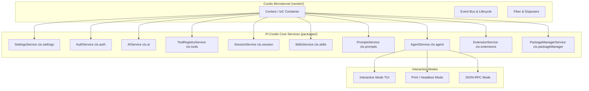

# Pi-Cordis (🥧) — 基于 Cordis (v4.0.1) 微内核的 AI Coding Agent

> **融合 Pi 极简纯粹的 Coding 核心能力与 Cordis “Everything is a plugin” 微内核设计哲学**

---

## 🎯 核心特性

1. **Cordis (v4.0.1) 微内核架构**：
   - 采用纯粹的依赖注入与微内核体系（`Context` / `Service` / `Plugin` / `Fiber`）。
   - 将 Pi 的设置、鉴权、模型驱动、工具注册、会话存储、技能、提示词模板、扩展系统与智能体调度全面重构为一等公民的 Cordis 服务（`ctx.settings`, `ctx.auth`, `ctx.ai`, `ctx.tools`, `ctx.session`, `ctx.skills`, `ctx.prompts`, `ctx.extensions`, `ctx.packageManager`, `ctx.agent`）。
2. **100% 保持 Pi 的功能与 TUI 体验**：
   - 交互式终端 UI（Canvas、差异化渲染、分支树选择器、Diff 对比、Markdown 渲染、状态栏）。
   - 全套核心编码工具（`read`, `write`, `edit`, `bash`, `grep`, `find`, `ls`）。
   - 完整支持 OpenAI、Anthropic、Gemini、DeepSeek、Mistral、Ollama、Bedrock 等全部主流模型提供商。
   - 命令行参数、Slash Commands（`/help`, `/model`, `/session`, `/clear`, `/compact`, `/tree`）100% 兼容。
3. **支持 Pi 原生插件生态 (`https://pi.dev/packages`)**：
   - 完整兼容 Pi 扩展体系（`registerTool`, `registerCommand`, `registerProvider`, `beforeSession`, `afterSession`, `transformPrompt` 等）。
   - 内置包管理器支持从 `pi.dev`、npm、git 和本地目录一键安装与管理扩展包。
4. **严格依赖隔离**：
   - 仅依赖 `vendor/` 下 vendored 的 Cordis 元框架内核，零引入 `deepseek-harness` 专属插件。

---

## ⚡ 快速开始

### 1. 安装依赖

```bash
pnpm install
```

### 2. 配置环境变量

在项目根目录下配置 `.env` 或设置环境变量：

```env
DEEPSEEK_API_KEY=sk-your-deepseek-api-key
# 或
OPENAI_API_KEY=sk-your-openai-api-key
# 或
ANTHROPIC_API_KEY=sk-your-anthropic-api-key
```

### 3. 运行体验

```bash
# 启动交互式 TUI
pnpm pi

# 执行单次任务并打印结果
pnpm pi -p "检查当前项目结构并列出核心模块"

# 查看所有可用模型
pnpm pi --list-models

# 运行自动化测试
pnpm test
```

---

## 🏗️ 架构拓扑


