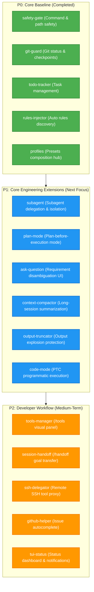

<div align="center">

# 🥧 Pi-Cordis

**The Developer-First Terminal Coding Agent, Rebuilt on the Cordis (v4.0.1) Microkernel with an "Everything is a Plugin" Architecture.**

[](LICENSE)
[](vendor/)
[](tsconfig.json)
[](packages/)
[](https://github.com/civaapple-alt/pi-cordis/pulls)

[English](README.md) | [中文说明](README.zh.md) | [Architecture Notes](.agents/notes/README.md) | [Contributing Guide](AGENTS.md)

</div>

---

## 📖 Table of Contents

- [Overview](#-overview)
- [Quick Start](#-quick-start)
- [Core Feature Matrix](#-core-feature-matrix)
- [Architectural Philosophy & Core Mechanisms](#-architectural-philosophy--core-mechanisms)
  - [1. Minimalist Philosophy & Default is Best](#1-minimalist-philosophy--default-is-best)
  - [2. DSH Capability Seams & Explicit Dependency Injection (inject)](#2-dsh-capability-seams--explicit-dependency-injection-inject)
  - [3. Registrations are Effects & Effects must be Reversible (Disposer Pattern)](#3-registrations-are-effects--effects-must-be-reversible-disposer-pattern)
  - [4. Dual-Track Layered HMR (Hot Module Replacement)](#4-dual-track-layered-hmr-hot-module-replacement)
  - [5. Control Plane to pi-tui: 7 Interactive UI Slots](#5-control-plane-to-pi-tui-7-interactive-ui-slots)
- [Native Cordis Plugins & Presets Matrix](#-native-cordis-plugins--presets-matrix)
- [Future Roadmap & Proposals](#-future-roadmap--proposals)
  - [Programmatic Tool Calling (PTC / Code Mode)](#-programmatic-tool-calling-ptc--code-mode)
  - [Plugin Ecosystem P0-P3 Evolution Matrix](#-plugin-ecosystem-p0-p3-evolution-matrix)
- [Cordis 10 Core Services Matrix](#-cordis-10-core-services-matrix)
- [Repository Structure](#-repository-structure)
- [Quality Gates & Testing](#-quality-gates--testing)
- [Architecture Decision Records (ADRs) Index](#-architecture-decision-records-adrs-index)
- [License](#-license)

---

## 🌟 Overview

**Pi-Cordis** fuses the raw speed, distraction-free terminal user interface (TUI), and coding power of [`earendil-works/pi`](https://github.com/earendil-works/pi) with the modular **Inversion-of-Control (IoC) microkernel** of **Cordis v4.0.1**.

### Why Pi-Cordis?

1. **100% Pi Parity**: Retains the complete interactive full-screen TUI, diff view, session branching tree, and prompt templates with zero user-facing regressions;
2. **"Everything is a Plugin"**: All 10 core capabilities (settings, auth, AI runtime, tool registry, session persistence, skills, prompt templates, extension runner, package manager, and agent inference loop) are decoupled into first-class Cordis services;
3. **"Default is Best" Minimalist Philosophy**: Out of the box, standard runs activate destructive action blocking, git checkpoints, prompt rules injection, and task tracking with zero manual configuration;
4. **DSH Capability Seams & Explicit `inject`**: Strict 3-layer orthogonal Seam design with access-control sandboxing and topological resolution via `export const inject = [...]`;
5. **Reversible Side Effects & Dual-Track HMR**: All registrations return disposers. Core services stay fast and programmatic while presets and plugin TypeScript sources support zero-restart live hot-reloading;
6. **Ecosystem Compatible**: Fully supports the [`pi.dev/packages`](https://pi.dev/packages) community marketplace via `npm:`, `git:`, or local paths;
7. **Strict Isolation**: 100% standalone. Zero dependencies on proprietary DSH plugins.

---

## ⚡ Quick Start

### 1. Prerequisites
- **Node.js**: `>= 20.0.0`
- **pnpm**: `>= 9.0.0`

### 2. Clone and Install
```bash
git clone https://github.com/civaapple-alt/pi-cordis.git
cd pi-cordis
pnpm install
```

### 3. Configure API Key
Create a root `.env` or set environment variables:
```env
# DeepSeek (Recommended)
DEEPSEEK_API_KEY=sk-your-deepseek-api-key

# Or OpenAI / Anthropic / Gemini / Ollama
OPENAI_API_KEY=sk-your-openai-api-key
ANTHROPIC_API_KEY=sk-your-anthropic-api-key
```

### 4. Launch
```bash
# Launch full-screen interactive TUI (Default is Best: fully armed & safe)
pnpm pi

# Switch profiles live in TUI via slash commands
/profile safe
/profile full

# Run a single task non-interactively
pnpm pi -p "Inspect the repository and list the 10 Cordis core services"

# Install a real community plugin from the ecosystem
pnpm pi install npm:@juicesharp/rpiv-todo
```

---

## 🎯 Core Feature Matrix

| Capability | Native Pi | Pi-Cordis | Highlights |
| :--- | :---: | :---: | :--- |
| **Interactive Terminal TUI** | ✅ | ✅ | Full-screen Canvas, double-buffered Diff, session tree, status widgets |
| **Core Coding Tools** | ✅ | ✅ | Built-in `read`, `write`, `edit`, `bash` + optional `grep`, `find`, `ls` |
| **Multi-Model Runtime** | ✅ | ✅ | 1307+ models (DeepSeek, OpenAI, Anthropic, Gemini, Ollama, etc.) |
| **Microkernel IoC Engine** | ❌ | ✅ | Reversible effect collection (`ctx.effect`), service injection (`static provide`) |
| **Explicit `inject` Sandboxing** | ❌ | ✅ | `inject = ['tools']` access control, dependency graph resolution |
| **Reversible Side Effects** | ❌ | ✅ | All registrations return `Disposer`s, eliminating zombie listeners |
| **Dual-Track Layered HMR** | ❌ | ✅ | Fast programmatic core boot + live zero-restart plugin code & preset HMR |
| **Standalone Presets Directory** | ❌ | ✅ | `presets/<name>/` (`preset.yml` + `cordis.yml`) declarative profiles |
| **Live TUI `/profile` Switch** | ❌ | ✅ | Interactive slash command with Tab autocompletion and select popup |
| **Extension Marketplace** | ✅ | ✅ | 100% compatible with `pi.dev/packages`, bridging `ExtensionAPI` to EventBus |
| **Zero DSH Dependencies** | N/A | ✅ | Self-contained, depending only on the clean `vendor/` Cordis microkernel |

---

## 🏛️ Architectural Philosophy & Core Mechanisms

### 1. Minimalist Philosophy & Default is Best
- **Default is Best**: The default mode (`default`) is the most complete, capable, and secure experience. It activates `safety-gate` (destructive command blocking), `git-guard` (checkpoints), `rules-injector` (prompt rules discovery), and `todo-tracker` (task management) out of the box with zero user configuration;
- **Presets Represent Distinct Agent Modes**: Presets represent high-level shifts in cognitive persona and permission boundaries (e.g. Standard Coding Mode / Plan Read-Only Mode / PTC Programmatic Mode), rather than artificial permutations of internal feature flags.

---

### 2. DSH Capability Seams & Explicit Dependency Injection (inject)
Strictly aligns with the tripartite Seam specification:
1. **Service Definition**: Module augmentations in `types.ts` declare methods and event payload contracts on `Context`;
2. **Service Provider**: Concrete driver classes in `services/*.ts` inheriting `Service` and declaring `static provide = 'key'`;
3. **Consumer**: Autonomous plugins in `packages/plugins/*` declaring `export const inject = ['tools']` to access services safely through Cordis Proxies.

```typescript
// Example: @pi-cordis/plugin-todo-tracker declarative injection
export const name = "todo-tracker";
export const inject = ["tools"]; // Explicit dependency; accessing undeclared services throws

export function apply(ctx: Context) {
  ctx.tools.register({ name: "todo_write", ... });
}
```

---

### 3. Registrations are Effects & Effects must be Reversible (Disposer Pattern)
- **Core Axiom**: All service registrations and event listeners must return a standard `Disposer` cleanup function;
- **4 Key Production Scenarios Beyond HMR**:
  1. **Runtime Profile Switching**: `/profile strict` unregisters blockers and restores write permissions with zero leftovers;
  2. **Subagent Sandboxing**: Temporary tools and event listeners in `ctx.fork()` are cleanly purged upon task completion;
  3. **Plan-Mode Transitions**: Read-only constraints are smoothly lifted upon plan approval;
  4. **Transactional Rollbacks**: Reverses partial registrations if an unexpected exception occurs during plugin `apply()`.

---

### 4. Dual-Track Layered HMR (Hot Module Replacement)
Combines sub-50ms CLI startup with live developer reload experience:
- **Kernel Base Layer**: 10 core services are loaded programmatically via TypeScript, preserving in-memory runtime objects like `AbortSignal` with zero overhead;
- **Dynamic HMR Layer**:
  - **YAML Watcher**: Automatically re-applies updated `presets/` configurations;
  - **Plugin Code HMR**: Dynamically busts Node.js ESM caching via `pathToFileURL + ?t=timestamp` for live zero-restart code replacement;
  - **Session State Intact**: Interactive conversation trees and memory registers remain completely untouched during hot reloads!

---

### 5. Control Plane to pi-tui: 7 Interactive UI Slots
Through `ExtensionService` (`ctx.extensions`), Cordis plugins seamlessly drive `pi-tui`'s double-buffered terminal canvas:

| TUI Slot | Code Example | Visual Presentation in Terminal |
| :--- | :--- | :--- |
| **Interactive Select Modal** | `await ctx.ui.select("Title", items)` | High-contrast cursor menu with arrow key navigation and Enter selection |
| **Confirmation Dialog** | `await ctx.ui.confirm("Are you sure?")` | `[Y/n]` modal preventing unintended destructive operations |
| **Header / Footer Widgets** | `ctx.ui.setHeader(...)` / `setFooter(...)` | Persistent status banners at top/bottom of canvas |
| **Toast Notifications** | `ctx.ui.notify("Task added", "info")` | Colored transient notification badges in terminal corner |
| **Custom Tool Renderers** | `pi.registerToolRenderer("todo_write", fn)`| Renders tool calls as custom graphical widgets (e.g. checkboxes `[✓]`) |
| **Message & Entry Renderers**| `pi.registerMessageRenderer(fn)` | Custom reasoning fold and streaming animations |
| **Status Bar Widgets** | `ctx.ui.setStatus("tasks", "3 pending")` | Live metric counters in footer status row |

---

## 🧩 Native Cordis Plugins & Presets Matrix

### 1. Four Native Cordis Plugins (`packages/plugins/*`)
- 🔒 **`@pi-cordis/plugin-safety-gate`**: Blocks destructive Shell commands (`rm -rf /`, `mkfs`) and sensitive configuration tampering (`.env`, `.git/`, `id_rsa`);
- 🛡️ **`@pi-cordis/plugin-git-guard`**: Detects dirty repository state and automatically creates `git stash` checkpoints on critical turns;
- 📋 **`@pi-cordis/plugin-todo-tracker`**: Registers `todo_write`/`todo_read` tools and dynamically injects active tasks into system prompts;
- 📜 **`@pi-cordis/plugin-rules-injector`**: Auto-scans `AGENTS.md`, `.claude/rules/*.md`, and `.cursorrules` to inject prompt guidelines.

### 2. Standalone Presets Directory (`presets/`)
```text
presets/
├── default/    # Default is Best: Safety + Git Checkpoints + Rules + Todo (Standard Dev)
├── safe/       # Safe Engineering Mode (High-risk command blocking + Protected paths)
├── strict/     # Strict Read-Only Audit Mode (Read-only inspection & blocking)
├── full/       # Power User Mode (All 4 native Cordis plugins activated)
└── minimal/    # Raw Lightweight Mode (Only 10 core microkernel services)
```

---

## 🚀 Future Roadmap & Proposals

### ⚡ Programmatic Tool Calling (PTC / Code Mode)
> Full Proposal: [PTC / Code Mode Architecture Proposal](.agents/notes/proposed/2026-08-20-pi-cordis-ptc-code-mode-architecture-proposal.md)

Inspired by DSH, PTC mode transforms loose JSON function calling into a **strongly-typed TypeScript SDK + single `run_code` tool**, enabling the model to collapse 5~10 serial network round-trips into **a single local execution**, cutting latency by 80%+ and saving 90%+ of Context Window tokens.

---

### 🗺️ Plugin Ecosystem P0-P3 Evolution Matrix
> Full Proposal: [Plugin Ecosystem Roadmap and Priority Matrix](.agents/notes/proposed/2026-08-19-pi-cordis-plugin-ecosystem-roadmap-and-priority.md)



---

## 🎛️ Cordis 10 Core Services Matrix

| Service Class | Property | Core Responsibility |
| :--- | :--- | :--- |
| `SettingsService` | `ctx.settings` | Global (`~/.pi/agent/settings.json`) and project-local (`.pi/settings.json`) settings |
| `AuthService` | `ctx.auth` | API keys, OAuth tokens, and secure credential storage |
| `AIService` | `ctx.ai` | Multi-model runtime encapsulation (1307+ models) and token metrics |
| `ToolRegistryService` | `ctx.tools` | Unified registry for 7 built-in coding tools and dynamic custom tools |
| `SessionService` | `ctx.session` | SQLite and in-memory session persistence, branching tree, and export |
| `SkillsService` | `ctx.skills` | Auto-scans, parses, and provides prompt and directory skills |
| `PromptsService` | `ctx.prompts` | Prompt template engine and parameter variable interpolation |
| `ExtensionService` | `ctx.extensions` | Loads Pi extensions and bridges `ExtensionAPI` to Cordis events and TUI slots |
| `PackageManagerService` | `ctx.packageManager` | Installs extensions from `pi.dev`, npm, git, and local paths |
| `AgentService` | `ctx.agent` | Agent multi-turn inference loop scheduler |

---

## 📂 Repository Structure

```text
pi-cordis/
├── vendor/                           # Vendored Cordis (v4.0.1) framework packages
│   ├── cordis/                       # @deepseek-ai/cordis
│   ├── cosmokit/                     # @deepseek-ai/cosmokit
│   └── schemastery/                  # @deepseek-ai/schemastery
│
├── presets/                          # 🌟 Declarative Agent capability and profile presets
│   ├── default/                      # preset.yml + cordis.yml (Default is Best)
│   ├── safe/                         # preset.yml + cordis.yml (Safe Engineering)
│   ├── strict/                       # preset.yml + cordis.yml (Read-Only Audit)
│   ├── full/                         # preset.yml + cordis.yml (Power User Mode)
│   └── minimal/                      # preset.yml + cordis.yml (Raw Microkernel)
│
├── packages/
│   ├── coding-agent/                 # CLI entrypoint, TUI, and Cordis bootstrapper
│   │   └── src/core/cordis/          # 10 core services + createPiContext + profile command
│   └── plugins/                      # 🌟 Native Cordis plugins workspace
│       ├── safety-gate/              # @pi-cordis/plugin-safety-gate
│       ├── git-guard/                # @pi-cordis/plugin-git-guard
│       ├── todo-tracker/             # @pi-cordis/plugin-todo-tracker
│       ├── rules-injector/           # @pi-cordis/plugin-rules-injector
│       └── profiles/                 # @pi-cordis/profiles (YAML & Preset HMR hub)
│
├── .agents/notes/                    # Architecture Decision Records (ADRs)
│   ├── implemented/architecture/     # Implemented architectural decisions
│   ├── implemented/simplification/   # Simplification and decoupling decisions
│   ├── proposed/                     # Proposals & Roadmaps (PTC, Minimalist Presets)
│   └── README.md                     # English index
│
├── CHANGELOG.md                      # Changelog (Keep a Changelog)
├── pnpm-workspace.yaml               # pnpm workspace configuration
└── tsconfig.json                     # TypeScript unified path aliases
```

---

## 🧪 Quality Gates & Testing

```bash
# Run all Cordis services, native plugins, presets, and HMR tests
npx vitest run packages/coding-agent/test/cordis-plugins-and-profiles.test.ts packages/coding-agent/test/cordis-bootstrap.test.ts

# TypeScript strict typecheck
pnpm run check

# Launch interactive terminal experience
pnpm pi
```

---

## 📝 Architecture Decision Records (ADRs) Index

### 🟢 Implemented Architectural Decisions
| Date | Title | Core Topic |
| :--- | :--- | :--- |
| `2026-08-19` | [Pi-Cordis: Microkernel Architecture Design](.agents/notes/implemented/architecture/2026-08-19-pi-cordis-microkernel-architecture.md) | "Everything is a plugin" philosophy, Vendored Cordis, 100% Pi parity |
| `2026-08-19` | [Pi-Cordis: Service Matrix and Plugin Ecosystem](.agents/notes/implemented/architecture/2026-08-19-pi-cordis-services-and-plugin-ecosystem.md) | 10 core services, `pi.dev/packages` compatibility, `ExtensionAPI` bridging |
| `2026-08-19` | [Pi-Cordis: TUI, UI Plugins, and Control Plane Trade-offs](.agents/notes/implemented/architecture/2026-08-19-pi-cordis-tui-and-control-plane-tradeoffs.md) | Strangler Fig pattern, silent TUI boot, terminal canvas vs web servers |
| `2026-08-19` | [Pi-Cordis: Repository Simplification & Decoupling](.agents/notes/implemented/simplification/2026-08-19-pi-cordis-repository-simplification.md) | Removing 1200+ duplicate source files, consuming official npm packages |
| `2026-08-19` | [Pi AgentHarness: Specification & Cordis Integration](.agents/notes/implemented/architecture/2026-08-19-pi-agent-harness-specification-and-cordis-integration.md) | Three Stores model, Effect Sandwich crash resilience, Lanes concurrency |
| `2026-08-19` | [Pi-Cordis: Native Cordis Plugins and Presets](.agents/notes/implemented/architecture/2026-08-19-pi-cordis-native-plugins-and-profiles.md) | `packages/plugins/*` workspace, standalone `presets/` directories, `/profile` |
| `2026-08-20` | [Pi-Cordis: Loader Trade-offs and Dual-Track HMR Architecture](.agents/notes/implemented/architecture/2026-08-20-pi-cordis-loader-and-dual-track-hmr-architecture.md) | Programmatic core boot, dual-track YAML & code HMR, ESM cache-busting |
| `2026-08-20` | [Pi-Cordis: Capability Seams, Explicit Injection (inject), and TUI Interaction Bridge](.agents/notes/implemented/architecture/2026-08-20-pi-cordis-capability-seams-inject-and-tui-bridge.md) | DSH tripartite seam alignment, Cordis v4 inject access sandbox, 7 TUI slots |
| `2026-08-20` | [Pi-Cordis: "Registrations are Effects, and Effects must be Reversible" and Disposer Pattern](.agents/notes/implemented/architecture/2026-08-20-pi-cordis-reversible-side-effects-and-disposer-pattern.md) | Reversible side effect axiom, 4 key scenarios beyond HMR (profile switching, subagent sandboxing, plan mode, atomic rollback) |

### 🟡 Proposed Architectural Roadmaps
| Date | Title | Core Topic |
| :--- | :--- | :--- |
| `2026-08-19` | [Pi-Cordis: Native Plugin Ecosystem Roadmap and Priority Matrix](.agents/notes/proposed/2026-08-19-pi-cordis-plugin-ecosystem-roadmap-and-priority.md) | 70+ extensions taxonomy, P0 -> P1 -> P2 -> P3 priority evolution matrix |
| `2026-08-20` | [Pi-Cordis: Programmatic Tool Calling (PTC / Code Mode) Architecture Proposal](.agents/notes/proposed/2026-08-20-pi-cordis-ptc-code-mode-architecture-proposal.md) | DSH Code Mode deep dive, round-trip collapse & context preservation, dynamic SDK synthesis |
| `2026-08-20` | [Pi-Cordis: Minimalist Design Philosophy and "Default is Best" Preset Simplification](.agents/notes/proposed/2026-08-20-pi-cordis-minimalist-presets-and-default-is-best-philosophy.md) | Deprecating 5 internal permutations, aligning with Pi's minimalist soul, Default is Best |

---

## 📄 License

[MIT](LICENSE) © 2026 civaapple-alt & Earendil Works.
