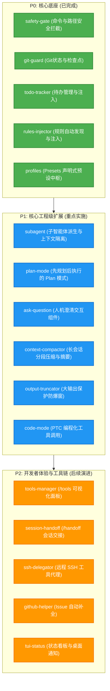

<div align="center">

# 🥧 Pi-Cordis

**专为开发者打造的终端 AI 编码智能体，基于 Cordis (v4.0.1) 微内核与“一切皆插件”架构重构。**

[](LICENSE)
[](vendor/)
[](tsconfig.json)
[](packages/)
[](https://github.com/civaapple-alt/pi-cordis/pulls)

[English](README.md) | 中文说明 | [架构决策记录 (ADR)](.agents/notes/README.zh.md) | [开发与贡献规范](AGENTS.md)

</div>

---

## 📖 目录索引

- [项目概述](#-项目概述)
- [快速开始](#-快速开始)
- [核心特性对比矩阵](#-核心特性对比矩阵)
- [架构设计哲学与核心机制](#-架构设计哲学与核心机制)
  - [1. 极简设计哲学与 Default is Best](#1-极简设计哲学与-default-is-best)
  - [2. DSH Capability Seams 与显式依赖注入 (inject)](#2-dsh-capability-seams-与显式依赖注入-inject)
  - [3. 注册即副作用，副作用必可逆 (Disposer 模式)](#3-注册即副作用副作用必可逆-disposer-模式)
  - [4. 双轨分层 HMR 热重载机制](#4-双轨分层-hmr-热重载机制)
  - [5. 控制面到 pi-tui 的 7 大交互槽位桥接](#5-控制面到-pi-tui-的-7-大交互槽位桥接)
- [原生 Cordis 插件与 Presets 预设体系](#-原生-cordis-插件与-presets-预设体系)
- [未来演进路线 (Roadmap & Proposals)](#-未来演进路线-roadmap--proposals)
  - [编程化工具调用 (PTC / Code Mode)](#-编程化工具调用-ptc--code-mode)
  - [插件生态 P0-P3 演进矩阵](#-插件生态-p0-p3-演进矩阵)
- [Cordis 10 大核心服务矩阵](#-cordis-10-大核心服务矩阵)
- [仓库目录结构](#-仓库目录结构)
- [质量门禁与测试体系](#-质量门禁与测试体系)
- [架构决策记录 (ADRs) 全景索引](#-架构决策记录-adrs-全景索引)
- [开源协议](#-开源协议)

---

## 🌟 项目概述

**Pi-Cordis** 深度融合了 [`earendil-works/pi`](https://github.com/earendil-works/pi) 极简纯粹的终端交互灵魂与 **Cordis v4.0.1** 的微内核控制面，100% 保持 Pi 的原生编码能力、交互式终端 UI（TUI）与扩展市场生态，同时引入高度解耦的服务矩阵、原生插件工作区与响应式热重载（HMR）能力。

### 为什么选择 Pi-Cordis？

1. **100% 保持 Pi 的功能与 TUI 体验**：保留全屏 Canvas、双缓冲 Diff 对比、分支树选择器、状态看板与流式 Markdown 高亮，零用户体验降级；
2. **“一切皆插件”的服务化解耦**：将配置、鉴权、多模型驱动、工具注册、会话存储、技能、提示词、扩展系统、包管理器与智能体推理循环 10 大能力全面重构为 Cordis 一等公民服务；
3. **“Default is Best” 极简哲学**：无需复杂配置，默认启动即具备完整安全拦截、Git 检查点、规则自动注入与待办追踪；
4. **DSH Capability Seams 与显式依赖注入**：严格遵循三层正交 Seams 规范，通过 `export const inject = [...]` 实现访问权限沙箱与无序启动拓扑解析；
5. **副作用必可逆与双轨 HMR**：底层注册必返回 Disposer，核心 Service 保持高效编程式装配，上层 Presets 与插件源码全面支持零重启实时热重载；
6. **全面兼容 `pi.dev/packages` 插件市场**：支持通过 `npm:`、`git:` 或本地路径一键安装社区扩展（如 `@juicesharp/rpiv-todo`）；
7. **严格依赖隔离**：完全独立自洽，零依赖 DSH 业务插件，底层仅依赖 `vendor/` 下的 Cordis 纯净内核套件。

---

## ⚡ 快速开始

### 1. 环境准备
- **Node.js**: `>= 20.0.0`
- **pnpm**: `>= 9.0.0`

### 2. 源码克隆与安装
```bash
git clone https://github.com/civaapple-alt/pi-cordis.git
cd pi-cordis
pnpm install
```

### 3. 配置 API Key
在项目根目录创建 `.env` 或配置系统环境变量：
```env
# DeepSeek (推荐)
DEEPSEEK_API_KEY=sk-your-deepseek-api-key

# 或 OpenAI / Anthropic / Gemini / Ollama
OPENAI_API_KEY=sk-your-openai-api-key
ANTHROPIC_API_KEY=sk-your-anthropic-api-key
```

### 4. 运行体验
```bash
# 启动全屏交互式 TUI (Default is Best: 开箱即用全能安全模式)
pnpm pi

# 在 TUI 终端中即时查看与切换 Profile 预设
/profile safe
/profile full

# 非交互模式执行单次任务
pnpm pi -p "检查当前项目结构并列出 10 大核心服务"

# 一键安装与体验社区扩展
pnpm pi install npm:@juicesharp/rpiv-todo
```

---

## 🎯 核心特性对比矩阵

| 能力维度 | 原生 Pi | Pi-Cordis | 亮点说明 |
| :--- | :---: | :---: | :--- |
| **交互式终端 TUI** | ✅ | ✅ | 全屏 Canvas、双缓冲 Diff 对比、分支树选择器、状态看板 |
| **核心编码工具集** | ✅ | ✅ | 内置 `read`, `write`, `edit`, `bash` + 可选 `grep`, `find`, `ls` |
| **多模型运行时** | ✅ | ✅ | 内置 1307+ 个模型（DeepSeek, OpenAI, Anthropic, Gemini, Ollama 等） |
| **微内核 IoC 控制体系** | ❌ | ✅ | 可逆副作用回收（`ctx.effect`）、服务自动注入（`static provide`） |
| **显式依赖注入 (inject)** | ❌ | ✅ | `inject = ['tools']` 权限沙箱、依赖拓扑推导与级联安全销毁 |
| **副作用可逆机制** | ❌ | ✅ | 所有注册均返回 `Disposer`，消除僵尸监听器与工具重复注册 |
| **双轨分层 HMR** | ❌ | ✅ | 核心 Service 极速冷启动，插件与 Presets 零重启代码级热重载 |
| **独立 Presets 预设体系** | ❌ | ✅ | `presets/<name>/`（`preset.yml` + `cordis.yml`）声明式组合 |
| **TUI `/profile` 热切换** | ❌ | ✅ | 终端输入 `/profile` 支持 Tab 补全与交互式下拉选择菜单 |
| **扩展市场生态兼容** | ✅ | ✅ | 100% 兼容 `pi.dev/packages`，透明桥接 `ExtensionAPI` 至事件总线 |
| **零 DSH 业务依赖** | N/A | ✅ | 独立自洽，仅使用 `vendor/` 下的 Cordis 纯净内核 |

---

## 🏛️ 架构设计哲学与核心机制

### 1. 极简设计哲学与 Default is Best
- **Default is Best**：默认模式（`default`）即是最完善、最安全的完整编码形态，开箱即用全量装配 `safety-gate`（安全拦截）、`git-guard`（Git 检查点）、`rules-injector`（规则注入）与 `todo-tracker`（待办追踪），95% 场景零配置直出；
- **预设代表角色形态差异**：预设不是微小功能开关的排列组合，而是代表智能体认知模式与权限边界的根本转变（如 Standard 编码模式 / Plan 只读规划模式 / PTC 编程化模式）。

---

### 2. DSH Capability Seams 与显式依赖注入 (inject)
严格对齐 DSH 官方三层正交角色规范：
1. **Service Definition（契约定义层）**：在 `types.ts` 中通过 TypeScript 声明合并扩充 `Context` 与 `Events` 规范；
2. **Service Provider（驱动实现层）**：在 `services/*.ts` 中继承 `Service` 并声明 `static provide = 'key'`；
3. **Consumer（能力消费层）**：在 `packages/plugins/*` 中声明 `export const inject = ['tools']`，通过 Cordis Proxy 实现属性访问权限沙箱与无序启动拓扑解析。

```typescript
// 示例：@pi-cordis/plugin-todo-tracker 声明式依赖注入
export const name = "todo-tracker";
export const inject = ["tools"]; // 显式声明依赖，未声明访问报错

export function apply(ctx: Context) {
  ctx.tools.register({ name: "todo_write", ... });
}
```

---

### 3. 注册即副作用，副作用必可逆 (Disposer 模式)
- **底层铁律**：所有服务注册与事件监听必须返回标准 `Disposer` 销毁函数；
- **脱离 HMR 的 4 大生产价值**：
  1. **Profile 运行时切换**：`/profile strict` 拦截器注销并还原写入权限；
  2. **Subagent 隔离与销毁**：`ctx.fork()` 专属沙箱，任务完成后调用 `dispose()` 原子清空；
  3. **Plan 模式状态流转**：从只读规划平滑切换至方案执行，临时限制无残留；
  4. **异常事务回滚**：插件中途加载失败时逆序执行 Disposer，保障系统状态一致性。

---

### 4. 双轨分层 HMR 热重载机制
兼顾终端极速冷启动（<50ms）与开发者极速调试体验：
- **Kernel Base Layer（底座层）**：10 大核心 Service 采用 TypeScript 编程式装配，保留 `AbortSignal` 等内存对象传递，零启动开销；
- **Dynamic HMR Layer（动态插件层）**：
  - **YAML 变更监听**：自动重载 `presets/` 预设并重新装配当前 Profile；
  - **源码级 HMR**：通过 `pathToFileURL + ?t=timestamp` 动态破坏 Node.js ESM 强缓存，实现零重启的源码级热替换；
  - **会话持久化**：热重载过程中终端对话树、内存状态完好保留！

---

### 5. 控制面到 pi-tui 的 7 大交互槽位桥接
通过 `ExtensionService`（`ctx.extensions`），Cordis 插件可无缝驱动 `pi-tui` 的双缓冲终端画布：

| TUI 交互槽位 | 代码调用示例 | 终端实际视觉呈现 |
| :--- | :--- | :--- |
| **交互式下拉选择器** | `await ctx.ui.select("选择预设", items)` | 在终端弹出高亮光标菜单，支持方向键选择与回车确认 |
| **二次确认弹窗** | `await ctx.ui.confirm("确定执行该操作？")` | 弹出 `[Y/n]` 模态框，阻止非预期破坏性执行 |
| **顶部/底部常驻挂件** | `ctx.ui.setHeader(...)` / `setFooter(...)` | 在终端顶部/底部渲染常驻状态条（如任务进度、Git 分支） |
| **浮动 Toast 通知** | `ctx.ui.notify("已添加新待办", "info")` | 在终端角落弹出带颜色的浮动提示框 |
| **工具专属自定义渲染器** | `pi.registerToolRenderer("todo_write", fn)`| 覆盖默认 JSON 卡片，渲染为带复选框 `[✓]` 的图形列表 |
| **消息与条目自定义渲染** | `pi.registerMessageRenderer(fn)` | 完全自定义模型消息与思考链（Thinking）的折叠/展开动画 |
| **状态栏微件 (Status)** | `ctx.ui.setStatus("tasks", "3 pending")` | 在 TUI 底部状态行实时显示当前任务统计 |

---

## 🧩 原生 Cordis 插件与 Presets 预设体系

### 1. 四大原生 Cordis 插件 (`packages/plugins/*`)
- 🔒 **`@pi-cordis/plugin-safety-gate`**：阻断破坏性 Shell 命令（`rm -rf /`, `mkfs`）与敏感配置文件篡改（`.env`, `.git/`, `id_rsa`）；
- 🛡️ **`@pi-cordis/plugin-git-guard`**：感知工作区脏状态，在关键操作轮次自动创建 `git stash` 检查点以供安全回滚；
- 📋 **`@pi-cordis/plugin-todo-tracker`**：注册 `todo_write`/`todo_read` 待办工具并自动将活跃任务注入提示词；
- 📜 **`@pi-cordis/plugin-rules-injector`**：自动扫描 `AGENTS.md`、`.claude/rules/*.md`、`.cursorrules` 并注入上下文提示词。

### 2. 独立 Presets 预设目录 (`presets/`)
```text
presets/
├── default/    # 默认即最佳: 安全拦截 + Git检查点 + 规则注入 + 待办追踪 (标准开发)
├── safe/       # 安全生产工程模式 (高危命令拦截 + 保护文件防篡改 + Git自动检查点)
├── strict/     # 只读代码审计模式 (只读安全拦截 + 阻断写操作)
├── full/       # 全能极客模式 (激活全部 4 大原生 Cordis 插件能力)
└── minimal/    # 零额外插件纯净模式 (仅保留 10 大核心微内核服务)
```

---

## 🚀 未来演进路线 (Roadmap & Proposals)

### ⚡ 编程化工具调用 (PTC / Code Mode)
> 提案详见：[PTC / Code Mode 架构设计提案](.agents/notes/proposed/2026-08-20-pi-cordis-ptc-code-mode-architecture-proposal.zh.md)

参考 DSH 核心设计，通过将零散的 JSON Function Calling 转换为**强类型 TypeScript SDK + 单一 `run_code` 执行器**，支持模型直接编写 TypeScript 脚本将 5~10 轮串行网络往返**坍缩为 1 轮本地程序化执行**，降低 80%+ 延迟并节省 90%+ Context Window 空间。

---

### 🗺️ 插件生态 P0-P3 演进矩阵
> 提案详见：[原生插件生态全景规划与优先级演进矩阵](.agents/notes/proposed/2026-08-19-pi-cordis-plugin-ecosystem-roadmap-and-priority.zh.md)



---

## 🎛️ Cordis 10 大核心服务矩阵

| 服务类 | 挂载属性 | 核心职责 |
| :--- | :--- | :--- |
| `SettingsService` | `ctx.settings` | 全局 (`~/.pi/agent/settings.json`) 与项目 (`.pi/settings.json`) 配置管理 |
| `AuthService` | `ctx.auth` | API 密钥、OAuth 令牌与凭证安全存储 |
| `AIService` | `ctx.ai` | 多模型运行时封装，内置 1307+ 个模型定义与 Token 消耗统计 |
| `ToolRegistryService` | `ctx.tools` | 统一管理 7 大内置编码工具与动态自定义工具注册中心 |
| `SessionService` | `ctx.session` | SQLite 与内存会话持久化存储、多分支树切换与会话导出 |
| `SkillsService` | `ctx.skills` | 自动扫描、解析并提供提示词与目录技能 |
| `PromptsService` | `ctx.prompts` | 提示词模板引擎与参数变量插值 |
| `ExtensionService` | `ctx.extensions` | 加载 Pi 原生扩展并透明桥接 `ExtensionAPI` 至 Cordis 事件与 TUI 槽位 |
| `PackageManagerService` | `ctx.packageManager` | 跨 `pi.dev`、npm、git 与本地来源的插件包安装管理 |
| `AgentService` | `ctx.agent` | 智能体多轮会话推理循环调度 |

---

## 📂 仓库目录结构

```text
pi-cordis/
├── vendor/                           # Vendored Cordis (v4.0.1) 内核套件
│   ├── cordis/                       # @deepseek-ai/cordis
│   ├── cosmokit/                     # @deepseek-ai/cosmokit
│   └── schemastery/                  # @deepseek-ai/schemastery
│
├── presets/                          # 🌟 声明式 Agent 能力与 Profile 预设目录
│   ├── default/                      # preset.yml + cordis.yml (默认即最佳)
│   ├── safe/                         # preset.yml + cordis.yml (安全生产工程)
│   ├── strict/                       # preset.yml + cordis.yml (只读代码审计)
│   ├── full/                         # preset.yml + cordis.yml (全能极客模式)
│   └── minimal/                      # preset.yml + cordis.yml (极简微内核模式)
│
├── packages/
│   ├── coding-agent/                 # CLI 入口、TUI 界面与 Cordis 引导器
│   │   └── src/core/cordis/          # 10 大核心服务 + createPiContext + profile command
│   └── plugins/                      # 🌟 原生 Cordis 插件集合
│       ├── safety-gate/              # @pi-cordis/plugin-safety-gate
│       ├── git-guard/                # @pi-cordis/plugin-git-guard
│       ├── todo-tracker/             # @pi-cordis/plugin-todo-tracker
│       ├── rules-injector/           # @pi-cordis/plugin-rules-injector
│       └── profiles/                 # @pi-cordis/profiles (YAML & 预设装配与 HMR 中枢)
│
├── .agents/notes/                    # 架构决策记录 (ADR)
│   ├── implemented/architecture/     # 已实施架构与生态决策
│   ├── implemented/simplification/   # 仓库精简与解耦决策
│   ├── proposed/                     # 未来演进与架构提案 (PTC/极简预设/生态规划)
│   └── README.zh.md                  # 中文索引
│
├── CHANGELOG.md                      # 中文更新日志 (Keep a Changelog)
├── pnpm-workspace.yaml               # pnpm 工作区配置
└── tsconfig.json                     # TypeScript 统一路径映射
```

---

## 🧪 质量门禁与测试体系

```bash
# 运行全部 Cordis 服务、原生插件、预设与 HMR 专属测试
npx vitest run packages/coding-agent/test/cordis-plugins-and-profiles.test.ts packages/coding-agent/test/cordis-bootstrap.test.ts

# TypeScript 严格类型检查
pnpm run check

# 启动交互式终端体验
pnpm pi
```

---

## 📝 架构决策记录 (ADRs) 全景索引

### 🟢 已实施架构决策 (Implemented ADRs)
| 提出日期 | 决策标题 | 核心主题 |
| :--- | :--- | :--- |
| `2026-08-19` | [Pi-Cordis: 基于 Cordis v4.0.1 的微内核架构设计](.agents/notes/implemented/architecture/2026-08-19-pi-cordis-microkernel-architecture.zh.md) | “一切皆插件”哲学、Vendored Cordis、严格依赖隔离、100% 保持 Pi 体验 |
| `2026-08-19` | [Pi-Cordis: 服务矩阵划分与扩展生态集成](.agents/notes/implemented/architecture/2026-08-19-pi-cordis-services-and-plugin-ecosystem.zh.md) | 10 大核心服务、`pi.dev/packages` 插件市场兼容、`ExtensionAPI` 事件桥接 |
| `2026-08-19` | [Pi-Cordis: TUI、UI 插件体系与控制面重构权衡](.agents/notes/implemented/architecture/2026-08-19-pi-cordis-tui-and-control-plane-tradeoffs.zh.md) | 控制面重构代价、TUI 静默装配、字符终端与 WebServer 困境、7 插槽演进 |
| `2026-08-19` | [Pi-Cordis: 仓库精简与上游依赖解耦](.agents/notes/implemented/simplification/2026-08-19-pi-cordis-repository-simplification.zh.md) | 移除 1200+ 冗余源码文件、直接消费官方 npm 依赖、仓库体积骤降 85% |
| `2026-08-19` | [Pi AgentHarness: 工业级事务规格与 Cordis 架构融合](.agents/notes/implemented/architecture/2026-08-19-pi-agent-harness-specification-and-cordis-integration.zh.md) | 三存储模型、副作用三明治（Effect Sandwich）、Lanes 多车道并发 |
| `2026-08-19` | [Pi-Cordis: 原生 Cordis 插件与独立 Presets 目录体系](.agents/notes/implemented/architecture/2026-08-19-pi-cordis-native-plugins-and-profiles.zh.md) | 独立子包工作区（`packages/plugins/*`）、独立 `presets/` 目录规范、`/profile` 终端热切换 |
| `2026-08-20` | [Pi-Cordis: Loader 权衡与双轨分层 HMR（热重载）架构设计](.agents/notes/implemented/architecture/2026-08-20-pi-cordis-loader-and-dual-track-hmr-architecture.zh.md) | 核心 Service 编程式高效装配、预设 YAML 与插件源码双轨 HMR、Node.js ESM 动态时间戳缓存破除 |
| `2026-08-20` | [Pi-Cordis: 能力 Seams、显式依赖注入（inject）与 TUI 交互桥接架构设计](.agents/notes/implemented/architecture/2026-08-20-pi-cordis-capability-seams-inject-and-tui-bridge.zh.md) | DSH 三层 Seam 角色对齐、Cordis v4 inject 权限沙箱与无序拓扑解析、ExtensionService 7 大终端交互槽位 |
| `2026-08-20` | [Pi-Cordis: “注册即副作用，副作用必可逆”与 Disposer 模式架构哲学](.agents/notes/implemented/architecture/2026-08-20-pi-cordis-reversible-side-effects-and-disposer-pattern.zh.md) | 副作用必可逆核心公理、脱离 HMR 的 4 大生产场景（Profile切换/Subagent隔离/Plan模式/事务回滚）与 Disposer 清理闭环 |

### 🟡 演进中架构提案 (Proposed ADRs)
| 提出日期 | 提案标题 | 核心主题 |
| :--- | :--- | :--- |
| `2026-08-19` | [Pi-Cordis: 原生插件生态全景规划与优先级演进矩阵](.agents/notes/proposed/2026-08-19-pi-cordis-plugin-ecosystem-roadmap-and-priority.zh.md) | 70+ 个扩展全景分类、P0 -> P1 -> P2 -> P3 优先级演进矩阵（Subagent、Plan模式、问答交互、输出截断与会话压缩） |
| `2026-08-20` | [Pi-Cordis: 编程化工具调用（PTC / Code Mode）架构设计与演进提案](.agents/notes/proposed/2026-08-20-pi-cordis-ptc-code-mode-architecture-proposal.zh.md) | DSH Code Mode 深度解析、轮次坍缩与上下文防爆、TypeScript SDK 动态合成与 `presets/ptc/` 落地规划 |
| `2026-08-20` | [Pi-Cordis: 极简设计哲学与 “Default is Best” 预设体系重构提案](.agents/notes/proposed/2026-08-20-pi-cordis-minimalist-presets-and-default-is-best-philosophy.zh.md) | 废除 5 大内部插件技术排列组合、回归 Pi 极简主义、Default 默认即最佳与 3 大场景级工作形态（Default/Plan/PTC） |

---

## 📄 开源协议

[MIT](LICENSE) © 2026 civaapple-alt & Earendil Works.
